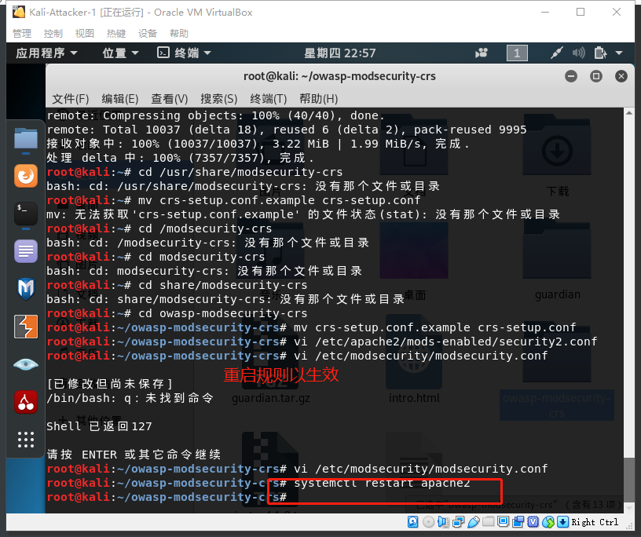

# 应用程序安全加固

## 实验目的

+ 从web和ssh方面进行应用程序安全加固的体验

## 实验环境

+ kali-attacker和kali-victim两台互相连通的主机

  


## 实验过程

### Apache内置安全设施

+ 先查看可用的模块并搜索需要的security模块

  ```
  ls -l /etc/apache2/mods-enabled/
  
  # 搜索security软件包
  apt search apache | grep security
  ```

  

  

+ 安装相关模块

  ```
  apt update &&apt-get install libapache2-mod-security2
  ```
  
  
  
+ 查看刚刚下载的与security相关的包

  

+ [配置规则](https://github.com/CUCCS/2018-NS-Public-jckling/blob/ns-0x10/ns-0x10/chap0x10实验.md)

  ```
  # 备份规则
  mv /usr/share/modsecurity-crs /usr/share/modsecurity-crs.bk
  
  # 下载 OWASP ModSecurity Core Rule Set
  git clone https://github.com/SpiderLabs/owasp-modsecurity-crs.git /usr/share/modsecurity-crs
  
  # 启用配置文件
  cd owasp-modsecurity-crs
  mv crs-setup.conf.example crs-setup.conf
  
  # 修改配置
  vi /etc/apache2/mods-enabled/security2.conf
  
  # 在文件中添加规则路径
  <IfModule security2_module> 
       SecDataDir /var/cache/modsecurity 
       IncludeOptional /etc/modsecurity/*.conf 
       IncludeOptional /usr/share/modsecurity-crs/*.conf 
       IncludeOptional /usr/share/modsecurity-crs/rules/*.conf 
   </IfModule>
  
  # 启用引擎
  vi /etc/modsecurity/modsecurity.conf
  
  # 将 DectionOnly 改为 On
  SecRuleEngine On
  
  # 重启以生效
  systemctl restart apache2
  ```

  
  
  
  
+ 将配置生效
  
  
  
  
  
+ 接着让攻击者主机对靶机进行简单的xss攻击（使用curl命令）
  
  
  
+ 使用`curl`指令进行测试，发现确实被拒绝
  
  
  
+ 查看日志文件，会发现该行为被记录了下来

  ```
  tail error.log
  ```

  


+ 至此，说明我们的规则设置生效了，此时的Web应用安全确实加固了，可用预防一些owasp中的一些攻击并且能通过日志记录下来


### 使用fail2ban防止ssh暴力破解

+ 在使用fail2ban之前进行ssh连接，发现失败了

  

+ 配置ssh配置文件，允许root权限ssh
  
  
  
+ 重启ssh服务，并添加了一块host-only网卡，成功连上ssh

  ```bash
  systemctl restart ssh
  ```


+ 爆破ssh，解压爆破字典，使用字典进行爆破，居然不到几秒钟就成功了！可见，弱口令真是不可用啊，万一被人爆破了ssh,那可约等于让‘攻击者’为所欲为了

  ```bash
  # 解压爆破字典
  gzip -d /usr/share/wordlists/rockyou.txt.gz
  
  # 类似的爆破工具还有：medusa/ncrack
  hydra -l root -P /usr/share/wordlists/rockyou.txt -v 192.168.56.101 ssh
  ```

  

+ 安装fail2ban
  
  
  
+ 可以在配置文件中看到对应的sshd.conf

  

+ 对配置文件中的配置项进行自定义配置

  

+ 配置好以后查看是否有被禁止的ip,发现暂时还没有，估计与设置的时间有关，并且可以看到是通过`/var/log/auth.log`进行检查是否有尝试爆破的ip

  

+ 在多次更新以后，发现了被禁止的ip，我们发现由于这是在跨网卡进行ssh操作，所以被禁止的并不是真正进行爆破的ip，而是`192.168.56.101`的网关

  

+ 在防火墙中我们也可以看到被禁止的ip，说明该禁止的原理就是通过设置防火墙规则进行拒绝

  

+ 至此，说明我们的fail2ban已经生效了，不再可以随意爆破ssh服务了，确实我们在攻击者主机上实验了一下，发现迟迟没有反应

  

+ 在上一章实验中我已经提到过实验结束需要恢复实验环境，因此我们使用以下命令清空刚刚的规则，保持环境的‘干净’

  ```bash
  fail2ban-client unban all
  ```

  


## 实验所遇问题

+ 虚拟机无法上网，发现双网卡模式需要手动配置


## 实验总结

+ mod-security的功能：—HTTP流量记录，实时监控和攻击检测，攻击防护和虚拟补丁，⿊名单/白名单/已知弱点和漏洞（规则），灵活的（检测和响应）规则引擎，支持嵌⼊式部署，支持⽹络部署，跨平台支持
+ fail2ban基本原理：监控日志⽂件，检索设定的访问指纹（正则表达式），匹配指纹成功后 


## 实验参考资料

+ [mod-security](https://sourceforge.net/projects/mod-security/)
+ [配置规则](https://github.com/CUCCS/2018-NS-Public-jckling/blob/ns-0x10/ns-0x10/chap0x10实验.md)
+ [ssh服务](https://linuxhint.com/enable-ssh-server-debian/)
+ [fail2ban官方手册](https://www.fail2ban.org/wiki/index.php/Main_Page)
+ [课本第十章](https://c4pr1c3.github.io/cuc-ns/chap0x10/main.html)
+ [第十章ppt](http://sec.cuc.edu.cn/huangwei/cuc-wiki/courses/2014_2/nsLecture0x10.pdf)

