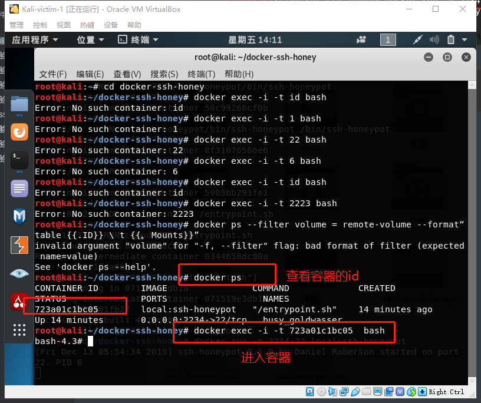
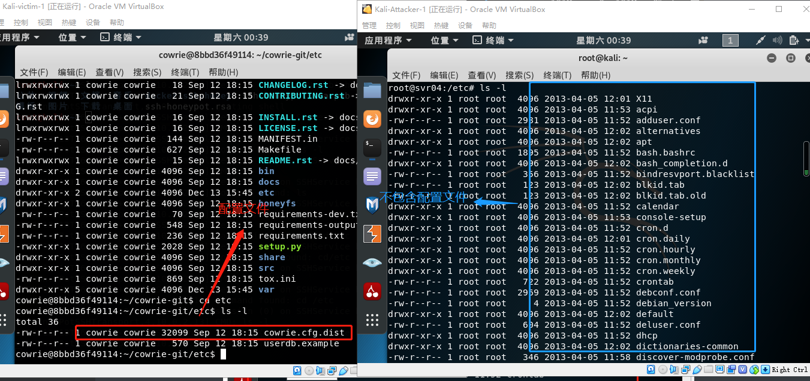
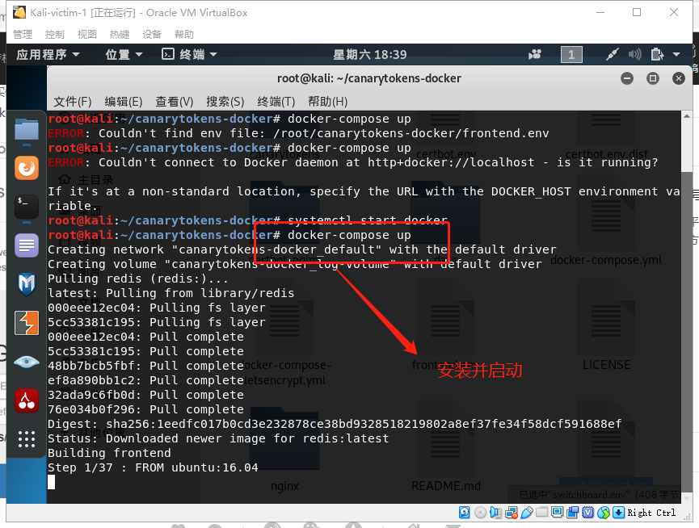

# 常见蜜罐体验和探索

## 实验目的

- 了解蜜罐的分类和基本原理
- 了解不同类型蜜罐的适用场合
- 掌握常见蜜罐的搭建和使用

## 实验环境

- 从paralax/awesome-honeypots中选择 1 种低交互蜜罐和 1 种中等交互蜜罐进行搭建实验
  
  - 推荐 `SSH` 蜜罐
  
- 实验拓扑：

  

## 实验要求

- [x] 记录蜜罐的详细搭建过程；
- [x] 使用 `nmap` 扫描搭建好的蜜罐并分析扫描结果，同时分析「 `nmap` 扫描期间」蜜罐上记录得到的信息；
- [x] 如何辨别当前目标是一个「蜜罐」？以自己搭建的蜜罐为例进行说明；
- [x] （可选）总结常见的蜜罐识别和检测方法；
- [x] （可选）尝试基于 [canarytokens](https://github.com/thinkst/canarytokens) 搭建蜜信实验环境进行自由探索型实验；


## 实验过程

+ 检查两台主机网络连通性

  

+ 接下来的实验在`victim`中搭建蜜罐，`attacker`中模仿攻击者去攻击伪`victim`

### ssh-Honeypot

+ 这是是一种极低交互式的简易蜜罐

+ 在`victim`中安装docker容器，便于实验的观察（按照教程安装）

+ 添加docker-ce的apt 源

  ```bash
  apt-get update
  apt-get install -y apt-transport-https ca-certificates curl software-properties-common
  curl -fsSL https://download.daocloud.io/docker/linux/ubuntu/gpg | sudo apt-key add -
  ```

  

+ 添加docker需要的密钥

  ```bash
  curl -fsSL https://download.docker.com/linux/debian/gpg | sudo apt-key add -
  
  ```

  

+ 验证密钥的可用性并进行docker-ce的安装

  ```bash
  sudo apt-key fingerprint 0EBFCD88
  sudo apt-get update
  sudo apt-get install docker-ce# 安装 Docker
  ```
  
  
  
+ 开启docker服务并测试是否安装成功

  ```bash
  systemctl start docker
  sudo docker run anything
  ```

  

+ 使用`docker image`指令查看镜像

  

+ 安装ssh-honeypot，首先确保libssh&libjson-c已经安装

  ```bash
  apt install libssh-dev libjson-c-dev
  ```

  

+ 安装ssh，暂时先不设置密码

  ```bash
  $ make
  $ ssh-keygen -t rsa -f ./ssh-honeypot.rsa
  ```
  
  
  
+ 接下来安装`docker-ssh-honeypot`

  ```bash
  git clone https://github.com/random-robbie/docker-ssh-honey
  docker build . -t local:ssh-honeypot#构建镜像
  docker run -p 2234:22 local:ssh-honeypot# 运行镜像 格式为本地端口:容器端口 
  docker exec -i -t id bash #进入容器
  tail -F ssh-honeypot.log#查看日志
  ```

  
  
  
  
+ 通过`docker ps`查看容器的id,这样才能进入容器

  ```bash
  docker ps
  docker exec -i -t container_id bash #进入容器
  ```

  

+ 可以进行查看日志，这样即可看到攻击者的行为，为了作对比，暂时我们先不做任何操作，查看当前的日志，发现确实并未记录下任何信息

  ```bash
  tail -F ssh-honeypot.log#查看日志
  ```

  

+ 接下来让`attacker`对蜜罐所在主机端口进行ssh连接，进行观察，发现安装蜜罐的主机日志已经把该行为记录下来了

  

+ 再次多次连接，发现无论输什么密码，连接都会被拒绝，原因是ssh-honeypot是一个低交互式的蜜罐，无法完成这些功能，但是日志能记录下所有攻击者的行为

  

+ 另外，仔细查看日志信息，我们发现攻击者的所有行为都被记录下来了，包括输入的密码等等，以及攻击者的ip也展露无遗，这达到了蜜罐的初步目标，即收集对方的信息

  

+ 接着`attacker`对目标主机进行nmap端口扫描，我们发现日志信息中并没有记录下，说明该蜜罐并未对此生效，也再一次说明了该蜜罐的低交互式，只是一个可以简单记录ssh连接的简易蜜罐

  

  
  
### Cowrie

+ Cowrie是一种中到高交互性的SSH和Telnet蜜罐，旨在记录暴力攻击和攻击者执行的shell交互。在中等交互模式（shell）下，它以Python仿真UNIX系统；在高级交互模式（代理）下，它充当SSH和telnet代理，以观察攻击者对另一个系统的行为。

+ Cowrie选择以仿真外壳运行（默认）：具有添加/删除文件功能的伪造文件系统。包含类似于Debian 5.0安装的完整伪造文件系统可能添加伪造的文件内容，以便攻击者可以监视/ etc / passwd等文件。仅包含最少的文件内容Cowrie保存使用wget / curl下载的文件或通过SFTP和scp上传的文件，以供以后检查；或将SSH和telnet代理到另一个系统:作为具有监控功能的纯telnet和ssh代理运行或者让Cowrie管理Qemu虚拟服务器池以提供登录到的系统

+ [在docker中安装Cowrie](https://hub.docker.com/r/cowrie/cowrie)

  ```bash
  docker pull cowrie/cowrie
  ```

  

+ 启动cowrie，在端口2222开启，同时在`attacker`中进行ssh连接攻击者，先使用正确的（其实说不上正确，毕竟本来就是伪造的）密码登录，发现日志信息已经记录下了所有行为
  
  ```bash
  docker run -p 2222:2222 cowrie/cowrie
  ```
  
  
  
+ 接下来不适用root用户连接，使用任意用户，发现在输入多次密码后被拒绝连接，猜想该蜜罐设置了不允许非root用户连接
  
  
  
+ 对于root用户，我们继续使用任意密码登录，我们会发现，输任意密码都可以登录，这也是该蜜罐的特点之一。由此可见，蜜罐的安全性必须保证，否则攻击者输入的是一段恶意代码，很有可能最后蜜罐反被当成“肉机”
  
  
  
+ 实验发现，没过多久，ssh连接就自动断开了，说明该蜜罐有设置连接时间限制，可能也是出于自我保护
  
  
  
+ 接着查看一下cowrie的日志文件，先进入容器，并查看日志所在目录，查看日志文件，需要注意的是，该蜜罐的日志文件是`json`文件，在日志中，我们可以看到刚刚的`attacker`连接的时间，ip等等信息
  
  ```bash
  docker exec -i -t container_id bash #进入容器
  cat cowrie.json #查看日志
  ```
  
  
  
  
  
+ 接下来在ssh连接的状态下，攻击者进行基本的连通性测试操作，发现`ping`和`curl`指令都正常运行了
  
  ```bash
  ping www.baidu.com #ping百度
  curl http://www.baidu.com/helloworld
  ```
  
  
  
+ 再次进行`curl`指令的使用，不输入正确的内容，发现返回了python的报错信息，这个蜜罐还有待提高啊！至少遇到这种输入不合法的可以设置防火墙过滤掉包，这样也不至于这么容易暴露
  
  
  
+ 接下来试着执行apt-get指令进行上次实验中`snort`包的下载，看起来好像没啥问题
  
  
  
+ 在蜜罐中接查看一下下载下来的文件，发现能看到文件信息，但是不能使用
  
  
  
+ 攻击者再次连续多次下载snort，发现每次都是新下载的，这说明前面下的是假的可执行文件，对于攻击者来说，很有可能就从这里发现蜜罐的存在了。按经验来说，连续的下载得到的回复应该是已安装，而不是新的安装，另外，安装的过程也与正常的安装有所不同
  
  
  
  
  
+ 接着，尝试对“靶机”进行nmap扫描，发现日志中居然也没有记录下这个信息，这个蜜罐也还是不太完善，但已经算是较高交互式的了，扫描的状态结果是开放，而service居然是`EthernetIp-1`，这显然不符合常理，通过这里也暴露出了蜜罐的存在
  
  ```bash
  nmap -sX -p 2222 -n -vv 10.0.2.15
  ```
  
  
  
+ 另外，查看一下cowrie的配置文件，这个配置文件还挺难找（一定要在容器中）
  
  ```bash
  cd ..#linux系统返回上一级目录命令
  ```
  
  
  
+ 配置文件详细信息如下
  
  ```bash
  NOTE: untested
  
  * Copy the file `docs/systemd/system/cowrie.socket` to `/etc/systemd/system`
  
  * Copy the file `docs/systemd/system/cowrie.service` to `/etc/systemd/system`
  
  * Examine `/etc/systemd/system/cowrie.service` and ensure the paths are correct for your installation if you use non-standard file system locations.
  
  * Add entries to `etc/cowrie.cfg` to listen on ports via systemd. These must match your cowrie.socket configuration:
  
      [ssh]
      listen_endpoints = systemd:domain=INET6:index=0
  
      [telnet]
      listen_endpoints = systemd:domain=INET6:index=1
  
  * Run:
      sudo systemctl daemon-reload
      sudo systemctl start cowrie.service
      sudo systemctl enable cowrie.service
  
  ```
  
  
  
+ 通过查阅官方文档，发现可以查看该蜜罐支持的命令，数目还是不小的，搭建蜜罐的过程中，也要格外注意命令的支持，尽量做到“真机有的我都有”

  

+ 查看文件分区，其实这是蜜罐搭建过程中非常重要的一步，因为攻击者很容易看出一些不太合理的文件分区

  

+ 在攻击者主机和容器内查看文件目录如下，在蜜罐容器内可以看到配置文件的信息，而攻击者中看不到，这也符合蜜罐的要求，毕竟这一旦被发现，“蜜罐”的存在也展露无遗了

  

+ 查看错误信息

  

+ 在`bin`目录下还有很多与蜜罐配置相关的信息，可以看到对用户的响应方式等

  


### Canarytokens

+ honeytokens是可以“以快速的，便捷的方式帮助防御方发现他们已经被攻击了的客观事实”。为了实现这个目标，我们可以使用Canarytokens应用来生成token,当入侵者访问或者使用由Canarytokens应用生成的honeytoken时，该工具将会通过邮件通知我们，并附带异常事件的细节说明。

+ 开始配置，先克隆仓库，并进入目录文件

  ```bash
  $ git clone https://github.com/thinkst/canarytokens-docker
  $ cd canarytokens-docker
  ```

+ 安装`docker-compose`

  ```bash
  $ sudo apt-get install python-pip python-dev #这个包好大！！
  $ sudo pip install -U docker-compose
  #if this breaks with PyYAML errors, install the libyaml development package
  # sudo apt-get install libyaml-dev
  ```

  

+ 修改配置文件frontend.env

  ```bash
  #These domains are used for general purpose tokens
  CANARY_DOMAINS=proshare.net ##google免费域名
  
  #These domains are only used for PDF tokens
  CANARY_NXDOMAINS=proshare.net
  
  #Requires a Google API key to generate incident map on history page
  #CANARY_GOOGLE_API_KEY=
  ```

+ switchboard.env

  ```bash
  #CANARY_MAILGUN_DOMAIN_NAME=x.y
  #CANARY_MAILGUN_API_KEY=zzzzzzzzzz
  #CANARY_MANDRILL_API_KEY=
  #CANARY_SENDGRID_API_KEY=
  CANARY_PUBLIC_IP=162.243.117.221
  CANARY_PUBLIC_DOMAIN=proshare.net
  CANARY_ALERT_EMAIL_FROM_ADDRESS=noreply@example.com  #my_email_address
  CANARY_ALERT_EMAIL_FROM_DISPLAY="Example Canarytokens"
  CANARY_ALERT_EMAIL_SUBJECT="Canarytoken"
  ```

+ 最后，下载并启动图像（其实包含大坑大坑！！！！！python库相关的error，过程太曲折，暂时没记录，调了一下午的大坑啊啊啊）然后是一个漫长的等待过程

  ```bash
   docker-compose up
  ```

  

+ 前端和总机现在将在前台运行。可以从http://example1.com/generate访问前端。如果您希望在后台运行此程序，则可以使用

  ```bash
  $ docker-compose up -d
  ```
  
+ 本来想在官网注册一个token，不知道是网站崩了还是什么？？点击无效，查看源代码也没检查出异样

  

+ 并且介于等了太久了都没下载完成，我放弃等待了，但是我猜想安装好以后应当产生的效果是：例如，当访问一个与预生成的token相符的URL时，应用将会通过邮件来进行告警通知。正如我们所看到的，该告警信息包括了访问该链接的源IP地址，访问的客户端浏览器信息。如果一开始不能接收到相关的告警通知，请检查下此前的Mailgun设置以及查看邮件账户的垃圾箱。如果我们使用Canarytokens生成一个Microsoft Word文档，在其被打开时，我们同样也会接收到告警邮件。但告警内容会与之前的告警略有不同，其中的客户端信息还会包含打开该Word文档的软件版本信息。其利用了底部一个隐藏的图像文件来感知打开情况。值得注意的是，在“ Protected View”模式下，是无法访问该Word文件的，需要点击“启用编辑”（Enable Editing）按钮才能触发honeytoken。（想必黄大网站上[期末考试样卷]触发的密信也是这个原理吧？？）

  


## 实验所遇问题

+ 构建镜像时无法执行，发现原因是虚拟机重启后未开启docker服务

+ 通过`tail -F ssh-honeypot.log`查看cowrie的日志文件，发现该蜜罐并未在系统中另外建立日志文件，而是在容器中保存的

+ python代码一直运行不成功，结果发现git下载下来的是一个大坑，代码需要修改

  
  
+ `canarytoken`官网突然注册不了token了！！！
  
  


## 实验总结

+ 蜜罐的识别和检测方法：

  + 从实验中，可以总结以下经验

    + 我们发现了一些指令的错误报的错是由某些语言编写的代码，例如上述`python`的报错即可以判断出蜜罐的存在；
    + 在安装包的时候我们也发现了蜜罐与普通真机的不同，通过这个也能初步判断“陷入”了蜜罐的陷阱中;
    + 在进行ssh连接时，发现任意密码都能登录，这也是暴露点之一；
    + 在目录中看不到应有的配置文件的存在，这也许是蜜罐搭建者想刻意隐瞒的信息

  + 从理论上，可以从以下几个角度判断

    + 配置失真与资源抢夺:我们已经知道低交互蜜罐是不能够给敌人提供一个完整的操作系统环境，所以可以通过使用一些复杂的命令和操作，以及一些想不到的输出解决来检查是不是处在蜜罐环境中。

    + 数据包时间戳分析:如果我们仅通过查看网络数据包能很容易的推断出一个机器的物理属性，我们就很有可能辨别物理服务器和虚拟蜜罐。事实证明，TCP提供了一些直接反映底层服务器状态的信息。TCP时间戳选项被网络堆栈用于确定重传超时时间。机器中的无历史中安特定频率更新时间戳，我们也知道，所有的物理时钟都有一定时钟偏差，他们或多或少于实际运行时间。

    + 环境不真实导致穿帮:我们很容易就能知道进行物理机器应有的配置，版本号等信息，而搭建的蜜罐往往在这方面做的不够完善，容易露陷

+ 在上述实验中，我们发现`ssh-honeypot`确实是一个低交互式的蜜罐，仅用于记录攻击者的信息，而`cowrie`是一个相对交互式较高、较完善的蜜罐，可以进行ssh远程连接等等一系列“类似真机”的操作

+ `Canarytokens`是非常常见的密信，可以以快速的，便捷的方式帮助防御方发现他们已经被攻击了的客观事实

+ `Canarytokens`的实验需要注册一个自己的新的域名

  ​    

    


## 实验参考资料

+ [搭建环境参考仓库](https://github.com/paralax/awesome-honeypots)
+ [ssh-honeypot](https://github.com/droberson/ssh-honeypot)
+ [cowrie](https://github.com/cowrie/cowrie)
+ [docker ssh-honeypot](https://github.com/random-robbie/docker-ssh-honey)
+ [安装docker](https://medium.com/@calypso_bronte/installing-docker-in-kali-linux-2018-1-ef3a8ce3648)
+ [docker教程](https://blog.csdn.net/hnytgl/article/details/80576868)
+ [ssh-honeypot简介](https://kalilinuxtutorials.com/kippo-honeypot-brute-force-attacks/)
+ [cowrie mannual](https://cowrie.readthedocs.io/en/latest/index.html)
+ [linux命令](https://www.jb51.net/LINUXjishu/661964.html)
+ [如何判断是否进入蜜罐](https://www.zhihu.com/question/31213254)
+ [canarytokens](https://docs.canarytokens.org/guide/getting-started.html#how-canarytokens-work-in-3-short-steps)
+ [canarytokens set-up](https://zeltser.com/honeytokens-canarytokens-setup/)


