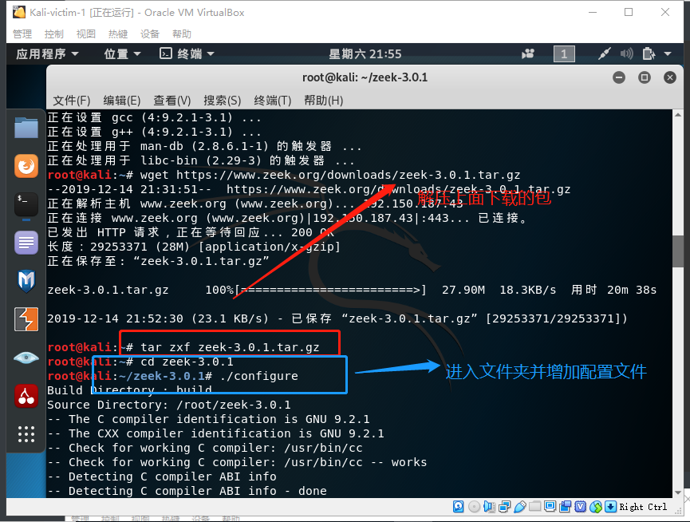

# 计算机取证

## 实验目的

+ 进行计算机取证的实战体验

## 实验要求

+ 使用 zeek 来完成取证分析

## 实验环境

+ 实验拓扑与上一章相同

  


## 实验过程

+ 首先进行`zeek`的安装，由于课本上建议安装zeek，原因是`bro`改名为`zeek`了，实验做到一半才发现的这个问题？？，顺便为下面的图片文字更正一下，不是不支持bro了，只是换了个名儿！

  ```bash
  apt-get  update
  
  # 2019-08-04 之前
  apt-get install bro bro-aux
  apt policy bro# 查看 bro 版本信息
  apt-get install bro bro-aux#安装bro以及bro的辅助工具
  bro -v#查看bro的版本
  # 2019-08-04 之后
  # ref: https://docs.zeek.org/en/stable/install/install.html#prerequisites
  # 如果系统使用的 Python 版本是 2.x
  apt update && apt-get install cmake make gcc g++ flex bison libpcap-dev libssl-dev python-dev swig zlib1g-dev python-ipaddress
  
  # 如果系统使用的 Python 版本是 3.x
  # apt update && apt-get install cmake make gcc g++ flex bison libpcap-dev libssl-dev python-dev swig zlib1g-dev
  ```

  

+ 进行zeek的安装，花了快十分钟！不知道是网速还是包真的很大

  ```bash
   wget https://www.zeek.org/downloads/zeek-3.0.1.tar.gz#官网下载
   
  # 解压缩 zeek 源码
  tar zxf zeek-3.0.1.tar.gz
  
  # 进入 zeek 源码解压缩后目录
  cd zeek-3.0.1
  
  # 生成构建脚本
  ./configure# 构建成功后安装到构建脚本默认指定路径 /usr/local/zeek，是用来检测安装平台的目标特征的
  make && make install #又是一个及其耗时的过程，make进行编译,make install进行安装
  
  # 将 zeek 可执行文件目录添加到当前用户的 PATH 环境变量
  if [[ $(grep -c '/usr/local/zeek/bin' ~/.bashrc) -eq 0 ]];then echo 'export PATH=/usr/local/zeek/bin:$PATH' >> ~/.bashrc;fi
  
  # 重新读取 ~/.bashrc 以使环境变量设置即时生效
  source ~/.bashrc
  ```
  
  

  
  
  
  
  

+ 实验环境基本信息

  ```bash
  cat /etc/os-release
  # PRETTY_NAME="Kali GNU/Linux Rolling"
  # NAME="Kali GNU/Linux"
  # ID=kali
  # VERSION="2019.3"
  # VERSION_ID="2019.3"
  # VERSION_CODENAME="kali-rolling"
  # ID_LIKE=debian
  # ANSI_COLOR="1;31"
  # HOME_URL="https://www.kali.org/"
  # SUPPORT_URL="https://forums.kali.org/"
  # BUG_REPORT_URL="https://bugs.kali.org/"
  
  uname -a
  # Linux firewall 5.2.0-kali2-amd64 #1 SMP Debian 5.2.9-2kali1 (2019-08-22) x86_64 GNU/Linux
  
  zeek -v
  # zeek version 3.0.1
  ```
  
  
+ 编辑`zeek`的配置信息，编辑 `/usr/local/zeek/share/zeek/site/local.zeek` ，在文件尾部追加两行新配置代码

  ```bash
  @load frameworks/files/extract-all-files
  @load mytuning.zeek
  ```

  

+ 在 `/usr/local/zeek/share/zeek/site` 目录下创建新文件 `mytuning.zeek` ，[内容为](https://www.bro.org/documentation/faq.html#why-isn-t-bro-producing-the-logs-i-expect-a-note-about-checksums)：

  ```bash
  redef ignore_checksums = T;
  ```

  
  
+ 使用 zeek 自动化分析 pcap 文件，首先下载`课本`中提供的pcap包文件，下载好了以后进行自动化分析

  ```bash
  zeek -r attack-trace.pcap /usr/local/zeek/share/zeek/site/local.zeek
  ```

  

+ 出现了警告信息`WARNING: No Site::local_nets have been defined. It's usually a good idea to define your local networks.`，进行编辑 `mytuning.zeek`即可解决，由于报的警告是变量未定义，于是增加一行变量定义，需要注意的是添加和不添加上述一行变量定义除了 zeek 运行过程中是否会产生警告信息的差异，增加这行关于本地网络 IP 地址范围的定义对于本次实验来说会新增 2 个日志文件，会报告在当前流量（数据包文件）中发现了本地网络IP和该IP关联的已知服务信息。

  ```bash
  redef Site::local_nets = { 192.150.11.0/24 };
  ```
  


  

+ 在 `attack-trace.pcap` 文件的当前目录下会生成一些 `.log` 文件和一个 `extract_files` 目录，在该目录下我们会发现有一个文件。

  ```bash
  file extract_files/extract-1240198114.648099-FTP_DATA-FHUsSu3rWdP07eRE4l
  # extract_files/extract-1240198114.648099-FTP_DATA-FHUsSu3rWdP07eRE4l: PE32 executable (GUI) Intel 80386, for MS Windows
  ```

  
  
  

+ 将该文件上传到 [virustotal](https://virustotal.com/) 我们会发现匹配了一个 [历史扫描报告](https://virustotal.com/en/file/b14ccb3786af7553f7c251623499a7fe67974dde69d3dffd65733871cddf6b6d/analysis/) ，该报告表明这是一个已知的后门程序！至此，基于这个发现就可以进行逆向倒推，寻找入侵线索了。通过阅读`/usr/local/zeek/share/zeek/base/files/extract/main.zeek` 的源代码

  ```bash
  function on_add(f: fa_file, args: Files::AnalyzerArgs)
          {
          if ( ! args?$extract_filename )
                  args$extract_filename = cat("extract-", f$last_active, "-", f$source,
                                              "-", f$id);
  
          f$info$extracted = args$extract_filename;
          args$extract_filename = build_path_compressed(prefix, args$extract_filename);
          f$info$extracted_cutoff = F;
          mkdir(prefix);
          }
  ```

  

+ 我们了解到该文件名的最右一个-右侧对应的字符串 `FHUsSu3rWdP07eRE4l` 是 `files.log` 中的文件唯一标识。通过查看 `files.log` ，发现该文件提取自网络会话标识（ `zeek` 根据 IP 五元组计算出的一个会话唯一性散列值）为 `Ca4P5U2d542zW0mxE5` 的 FTP 会话。

  

+ 可以确定这是用户通过 ftp 上传的恶意的可执行文件，根据文件标识 (files.log) 找到会话标识 (conn.log)，进而找到该恶意用户的 ip 地址,该 `Ca4P5U2d542zW0mxE5` 会话标识在 `conn.log` 中可以找到对应的 IP 五元组信息。

  ```bash
   cat files.log | zeek-cut conn_uids
  ```

  

+ 通过 `conn.log` 的会话标识匹配，我们发现该PE文件来自于IPv4地址为：`98.114.205.102` 的主机。

  

+ `ftp.log` 中默认不会显示捕获的 FTP 登录口令，我们可以通过在 `/usr/local/zeek/share/zeek/site/mytuning.zeek` 中增加以下变量重定义来实现

  ```bash
  redef FTP::default_capture_password = T;
  ```

  
  
  


+ 使用正确的分隔符进行过滤显示的重要性，实验证明可读性高了好多

  ```bash
  # 从头开始查看日志文件，显示前1行
  head -n1 conn.log
  
  # Bro的日志文件默认使用的分隔符显示为ASCII码\x09，通过以下命令可以查看该ASCII码对应的“可打印字符”
  echo -n -e '\x09' | hexdump -c
  
  # 使用awk打印给定日志文件的第N列数据
  awk -F '\t' '{print $3}' conn.log
  ```

  


+ 查看Bro的超长行日志时的横向滚动技巧

  ```bash
  less -S conn.log
  ```

  


+ 使用 `zeek-cut` 更“优雅”的查看日志中关注的数据列

  ```bash
  # 查看conn.log中所有可用的“列名”
  grep ^#fields conn.log | tr '\t' '\n'
  
  # 按照“列名”输出conn.log中我们关注的一些“列”
  zeek-cut ts id.orig_h id.orig_p id.resp_h id_resp_p proto < conn.log
  
  # 将UNIX时间戳格式转换成人类可读的时间（但该方法对于大日志文件处理性能非常低）
  zeek-cut -d < conn.log
  ```

  
  
+ 其实应该在实验前就发现这些提高可读性的技巧的，也不至于在观察上花费这么多时间了


## 实验所遇问题

+ 一开始`bro`一直安不上，才发现`bro'改名为`zeek`了，是bro不好听吗hhh？

+ 下载`zeek`耗时特别长，后来使用校园网内老师提供的镜像以后就好些了，但是还是没有解决编译过程太久的问题，只有等待,真的太久了！！

  ```bash
  wget http://sec.cuc.edu.cn/ftp/soft/zeek-3.0.0.tar.gz
  ```

  


## 实验总结

+ bro（改名为zeek）是一款**被动的开源流量分析器**。它主要用于对链路上所有深层次的可疑行为流量进行安全监控，为网络流量分析提供了一个综合平台，**特别侧重于语义安全监控**。虽然经常与传统入侵检测/预防系统进行比较，但bro采用了完全不同的方法，为用户提供了一个灵活的框架，**可以帮助定制**，深入的监控远远超出传统系统的功能。

+  `bro`，`snort`（上次实验做过的）,`wireshark`（以往惯用工具）的横向对比

  |            | Bro                          | Snort              | Wireshark& Tshark |
  | ---------- | ---------------------------- | ------------------ | ----------------- |
  | 优势       | 高级的 异常检测              | 正则表达式，签名   | 流量分析          |
  | 关注数据   | 连接对象， 事件              | 数据包， 数据流    | 协议剖析          |
  | 可编程性   | Bro DSL                      | 不                 | 不                |
  | 实时或重放 | 兼备                         | 兼备               | Pcap重放          |
  | 应用层     | 应用层 自动化， 数据动态分发 | 自动化， OpenAppID | 手动， 解析器     |


## 实验参考资料

+ [zeek官方推荐工具](https://c4pr1c3.github.io/cuc-ns/chap0x12/exp.html)
+ [zeek下载](https://www.zeek.org/download/index.html)
+ [日常linux命令查询](https://www.cnblogs.com/tinywan/p/7230039.html)
+ [bro与各工具的对比](https://www.cnblogs.com/tanghaoth666/p/10450074.html)


