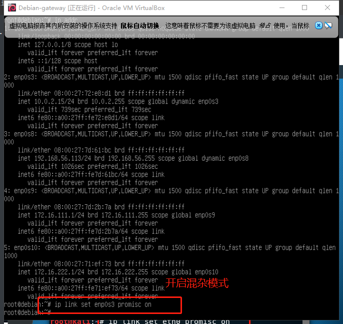
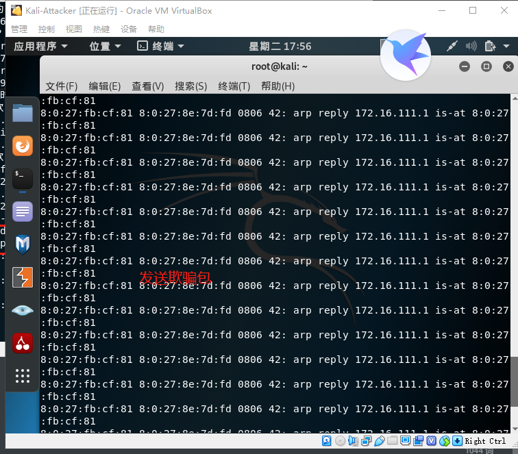

# 实验四 网络监听

## 一、网络监听的监测

### 检测局域⽹中的异常终端

#### 实验目的

+ 交换机状态查看（可⽹管的交换机）
  –CAM表变化情况 
+ 在发送者和接收者主机上分别抓包分析 
  —检测⽹卡是否处于混杂模式使用的数据包内容有
  什么区别

#### 实验先修知识

+ 无线网卡监听模式和混杂模式有什么不同：
  + 监听模式允许网卡不用连接wifi就可以抓取特性频道的数据，就是在空气中抓取某个波段的数据。可以用在破解wifi密码上
  + 混杂模式（连接wifi）就是接收所有经过网卡的数据包，包括不是发给本机的包，即不验证MAC地址
  + 普通模式下网卡只接收发给本机的包
+ scapy编程部分知识

#### 实验环境

+ chap1用到的attacker和gateway，此时网关并未开启混杂模式，攻击者主机的CAM表中也无网关信息

  

#### 实验过程

+ 由于上一章的实验网关开启了tinyproxy服务，一开始攻击者ping不通网关

+ 攻击者在ping通之前arp表不含网关

  

+ 关闭tinyproxy服务后，ping通网关

  
  
+ ping通之后再查看arp缓存（CAM)表

  

+ 网关进行抓包，发现抓到了攻击者所有的包

  

+ [nmap]( https://www.cnblogs.com/nmap/p/6232207.html )：是扫描主机端口，嗅探所提供的网络服务，是探测一组主机是否在线，还可以推断主机所用的操作系统，到达主机经过的路由，系统已开放端口的软件版本

+ **promiscping**: Send ARP who-has requests to determine which hosts are in promiscuous mode为查看混杂模式主机而发送ARP请求 

+ 用scapy（linux系统下自带的工具）的promiscping进行探测

  

+ 使用promiscping进行发送Arp包，并查看是否有回应，发现没有回应

  + **注意：此时网关不可使用tcpdump！！这会导致开启混杂模式，从而收到回应**

  

+ 或使用课件内容构造2层报⽂直接发送，但是每次输到"ip的dst"时，就会出错，暂时只有第一种方式成功

  

+ 接着将网卡开启混杂模式

  ```
  ip link set eth0 promisc on
  ```
  
  
  
+ 查看已开启混杂模式

  

+ 开启混杂模式以后，再用promiscping进行发包探测，发现得到了一个回复包，可知探测的网卡是混杂模式

  

+ 实验至此，我们已经通过发送arp广播嗅探包的方式，发现了处于混杂模式的网卡。

#### 实验遇到的问题

+ 使用课件内容构造2层报⽂直接发送时，但是每次输到"ip的dst"时，就会出错，暂时只有第一种方式成功
+ 开启混杂模式的应该是网关，一开始设置攻击者，一直没有成功

#### 实验参考资料

+ [nmap使用]( https://www.cnblogs.com/nmap/p/6232207.html )
+ [scapy的部分学习]( https://blog.csdn.net/th_num/article/details/54135340 )
+ [师姐的作业]( https://github.com/CUCCS/2018-NS-Public-jckling/tree/ns-0x04/ns-0x04 )


---


##  二、arp污染

### 实验环境

+ 本次实验只需要一台攻击者,一台网关，一台受害者，三台机器处于同一个内网中
+ 工具:arpspoof
  + 指定目标的arp欺骗重定向

### 实验目的/原理

+ 对主机进行arp污染，从而使主机无法知道网关mac地址而无法上网

### 实验步骤

+ 验证网络的连通性，并查看arp缓存,都包含了网关的mac地址

  

  

+ arpspoof欺骗，伪造成网关，向受害者发送自己的mac地址

  ```
  arpspoof -i eth0  -t 
  ```

  

+ 在此之前，记得开启路由转发功能,且要先安装disniff

  

+ 欺骗开始

  

  
  
  + 受害者抓包,看到攻击者发过来的伪造包，仿造的arp回应
  
    
  
  + 最终造成的效果是靶机无法上网，也就是arp伪造成功了
  
    
  
    
  
    
    
### 实验参考资料

  + [实验参考]( https://www.jianshu.com/p/63a0b36a0c81 )
  + [arpspoof使用]( https://blog.csdn.net/china_jeffery/article/details/78689582 )
  
    


  


