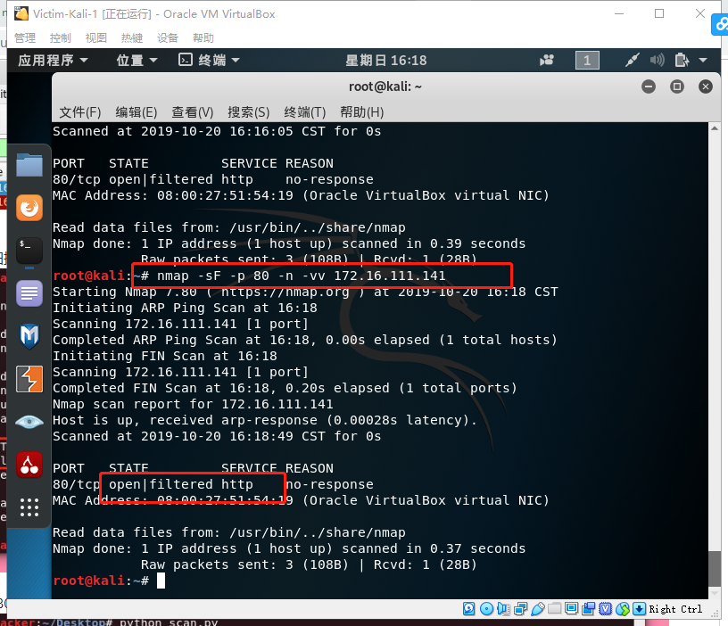
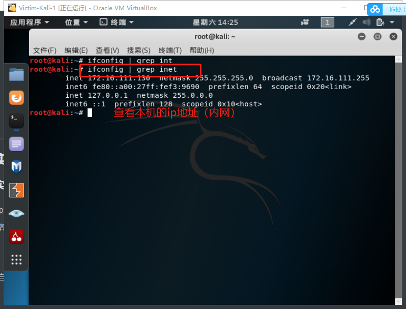

# 第五章 网络扫描

---

## 课后作业：基于 Scapy 编写端口扫描器

### 实验目的

- 掌握网络扫描之端口状态探测的基本原理

### 实验环境

- python + [scapy](https://scapy.net/)2.4

- 实验网络环境拓扑

  

### 实验先修知识

+ kali中基本端口开启/关闭命令
  ```
  nc -l -p 8888 -u//指定端口开启关闭（基础的TCP/UDP监听）
  nestat -anop | grep 80（listen)//监听80端口
  lsof -i 4 -L -P -n//查看处于监听状态的端口
  ```

+ scapy编程基本使用

  ```
    pkt=IP()/ICMP()//构造包
    pkt.show()//显示包
    ls()//查看包
    lsc()//列举scapy内置函数
    sr()//包含发送和接受包（网络层)
    srp()//在第二层发送和接受包（数据链路层构造）
    srp1()//只接受1个包
    pkt=IP(dst='172.16.111.141')//目的地址指定
    send(pkt)//只发送数据包
    exit //退出编程模式回到命令行
    ret[ICMP].type //访问数据包
    ret[IP]//访问数据包
    pkt=Ethernet/IP/ICMP//构造更下层的包
    ret [Ether].fields//查看目的地址/源地址/包类型
    pkt=Ether(src='',dst='')//可以构造局域网中的数据包
    help(src) help(IP)//查看官方帮助信息
    q //退出帮助信息
    pkts=sniff(iface='eth0',count=100)//进行抓包，指定100个数据包
    pkts.nsummary()//查看数据包
    pkts[99][IP]//查了第99个包的数据
    pkts[99][Padding]//查看padding信息
    pkts[99][TCP].flag//查看标志位
    pkts=rcap('')//查看抓的包的结果
    help(wrpcap)//保存抓包结果
  ```

+ 端口状态分为以下几种（摘自ppt）

  

### 实验要求(完成度)

- [x] 完成以下扫描技术的编程实现
- [x] TCP connect scan / TCP stealth scan
- [x] TCP Xmas scan / TCP fin scan / TCP null scan
- [x] UDP scan
- [x] 上述每种扫描技术的实现测试均需要测试端口状态为：`开放`、`关闭` 和 `过滤` 状态时的程序执行结果
- [x] 提供每一次扫描测试的抓包结果并分析与课本中的扫描方法原理是否相符？如果不同，试分析原因；
  + 基本相符，但是在使用编程扫描的时候比课本中实现的更详细，例如` UDP`扫描中,我们可以看到课本中提供的只是在收到UDP包的情况下可以确认端口为开放状态下，编程实现的过程中还可以通过ICMP包中是否包含UDP包进行判断端口是否为开放状态。这是由于编程实现可以更加详细的分析抓到的包。
  + 抓包结果附在附件中：[抓包结果](./wireshark抓包结果)
- [x] 在实验报告中详细说明实验网络环境拓扑、被测试 IP 的端口状态是如何模拟的
- [x] （可选）复刻 `nmap` 的上述扫描技术实现的命令行参数开关（每种扫描测试一种状态，且后面专门用nmap进行了扫描实验）

### 实验过程

#### TCP connect scan

+ 实验预期获得的结果：倘若攻击者向靶机发送SYN包，能完成三次握手，收到ACK,则端口为开发状态；若只收到一个RST包，则端口为关闭状态；倘若什么都没收到，即为端口过滤状态。

  
  
+ scapy编程python代码实现（代码是根据对包的观察进行编写的）

  ```python
  def tcpconnect_scan(dst_ip , dst_port , timeout = 10):
      pkts = sr1(IP(dst = dst_ip) / TCP(dport = dst_port , flags = "S") , timeout = timeout)#sr1()表示只接受一个包，此步在构造SYN包，flags="S"表示为SYN包
      if(str(type(pkts))=="<type 'NoneType'>"):
         print ("filter")
      elif (pkts.haslayer(TCP)):
         if (pkts[1].flags == 'AS'):#由经验可知，我们收到的第一个包即为第一个回来的tcp包,若为ACK包，则为开放状态
              print ("Open")
         elif (pkts[1].flags == 'AR'):#收到的第一个包为RST包，则为关闭状态
              print ("Close")
  tcpconnect_scan('172.16.111.141',80) 
  ```

  

  + 这是第一次执行代码的结果，显示端口为`关闭` ，同时我们对抓包结果进行观察，发现结果为一致

    

    

  + 接着将该端口`开启`后再执行代码（开启apache服务）

    ```
     systemctl start apache2
    ```
  
    
    
    
    
  + 再执行刚刚的代码，并同时进行抓包，发现此时端口处于开启状态
    
    
    
    
  
+ 用nmap命令进行扫描，发现结果一致

  ```
  nmap -sT -p 80 -n -vv 172.16.111.141
  ```

  

 + 在靶机中`过滤`80端口的tcp包

   ```
   iptables -A INPUT -p tcp --dport 80 -j DROP
   ```

   

+ 再执行该代码，得到端口为过滤状态，抓包结果中确实只有一个接收到的TCP包

  

  

---

#### TCP stealth scan

+ 与TCP connect scan扫描非常相似，因此此处实验简化一些步骤

+ ```python
  def tcpstealth_scan(dst_ip , dst_port , timeout = 10):
      pkts = sr1(IP(dst=dst_ip)/TCP(sport=src_port,dport=dst_port,flags="S"),timeout=10)
      if(str(type(pkts))=="<type 'NoneType'>"):
          print ("Filtered")
      elif(pkts.haslayer(TCP)):
          if(pkts.getlayer(TCP).flags == 0x12):
              send_rst = sr(IP(dst=dst_ip)/TCP(dport=dst_port,flags="R"),timeout=10)
              print ("Open")
          elif (pkts.getlayer(TCP).flags == 0x14):
              print ("Closed")
          elif(pkts.haslayer(ICMP)):
              if(int(pkts.getlayer(ICMP).type)==3 and int(stealth_scan_resp.getlayer(ICMP).code) in [1,2,3,9,10,13]):
          #code 1 : Host unreachable error.
          #code 2 : Protocol unreachable error.Sent when the designated transport protocol is not supported.
          #code 3 : Port unreachable error. Sent when the designated transport protocol is unable to demultiplex the datagram but has no protocol mechanism to inform the sender.
          #code 9 : The destination network is administratively prohibited.
          #code 10 : The destination host is administratively prohibited.
          #code 13 : Communication Administratively Prohibited.This is generated if a router cannot forward a packet due to administrative filtering.
                  print ("Filtered")
  tcpconnect_scan('172.16.111.141',80)             
  ```

+ 紧接着上面实验的`过滤`状态可得

  

  

+ 去掉过滤条件并`开启`端口80后（此处开启apache服务）

  ```
  systemctl start apache2
  iptables -I INPUT -p tcp --dport 80 -j ACCPET//需要注意的是记得关闭过滤规则，否则无法开启
  ```

+ 

+ 使用nmap命令进行扫描，发现得到结果一致

  ```
  nmap -sS -p 80 -n -vv 172.16.111.141
  ```

  

+ 之后把端口80`关闭`，得到以下结果

  

---

####  TCP Xmas scan 

+ 先修知识：这是一种隐蔽性扫描，当处于端口处于关闭状态时，会回复一个RST包；其余所有状态都将不回复

  

+ 代码如下：

  ```python
  def Xmas_scan(dst_ip , dst_port , timeout = 10):
      pkts = sr1(IP(dst=dst_ip)/TCP(dport=dst_port,flags="FPU"),timeout=10)#发送FIN,PUSH,URG
      if (str(type(pkts))=="<type 'NoneType'>"):#未收到任何包可能为这两种状态
          print ("Open|Filtered")
      elif(pkts.haslayer(TCP)):
          if(pkts.getlayer(TCP).flags == 0x14):
              print ("Closed")#收到RST包即为端口关闭状态
      elif(pkts.haslayer(ICMP)):
          if(int(pkts.getlayer(ICMP).type)==3 and int(pkts.getlayer(ICMP).code) in [1,2,3,9,10,13]):
              print ("Filtered")
  Xmas_scan('172.16.111.141',80)
  ```

+ 端口处于`关闭`状态下（由于上一个实验正关闭着）

  

+ 端口处于`开启`状态下：(与其他状态不同的是，这里没有arp包,我认为是本应该有，也许用了缓存)

  

+ 另外，我们分析这个包，发现收到的包确实包含了FPU三个字段

  

+ 端口处于开启状态下时，使用nmap进行扫描

  ```
  nmap -sX -p 80 -n -vv 172.16.111.141
  ```

  

+ 端口处于`过滤`状态，注意，此时抓到的包是**ARP**包，并不是**TCP**包

  

---


#### TCP FIN scan

+ 先修知识：仅发送FIN包，FIN数据包能够通过只监测SYN包的包过滤器，隐蔽性较SYN扫描更⾼，此扫描与Xmas扫描也较为相似，只是发送的包未FIN包，同理，收到RST包说明端口处于关闭状态；反之说明为开启/过滤状态。

  

+ 代码如下：

  ```python
  def fin_scan(dst_ip , dst_port , timeout = 10):
      pkts = sr1(IP(dst=dst_ip)/TCP(dport=dst_port,flags="F"),timeout=10)#发送FIN包
      if (str(type(pkts))=="<type 'NoneType'>"):#未收到任何包可能为这两种状态
          print ("Open|Filtered")
      elif(pkts.haslayer(TCP)):
          if(pkts.getlayer(TCP).flags == 0x14):
              print ("Closed")#收到RST包即为端口关闭状态
      elif(pkts.haslayer(ICMP)):
          if(int(pkts.getlayer(ICMP).type)==3 and int(pkts.getlayer(ICMP).code) in [1,2,3,9,10,13]):
              print ("Filtered")
  fin_scan('172.16.111.141',80)
  ```

+ 还是延续上个实验的`过滤`状态

  

+ 端口处于`开启`状态

  

+ 另外，分析包后发现确实只发送了FIN包

  

+ 用nmap进行扫描,得到的结果也是过滤/开启状态

  ```
  nmap -sF -p 80 -n -vv 172.16.111.141
  ```

  

+ 端口处于`关闭`状态

  

---

####  TCP null scan 

+ 实验先修知识：发送的包中关闭所有TCP报⽂头标记，实验结果预期还是同理：收到RST包说明端口为关闭状态，未收到包即为开启/过滤状态

  

+ 代码如下：

  ```python
  def null_scan(dst_ip , dst_port , timeout = 10):
      pkts = sr1(IP(dst=dst_ip)/TCP(dport=dst_port,flags=""),timeout=10)#发送FIN包
      if (str(type(pkts))=="<type 'NoneType'>"):#未收到任何包可能为这两种状态
          print ("Open|Filtered")
      elif(pkts.haslayer(TCP)):
          if(pkts.getlayer(TCP).flags == 0x14):
              print ("Closed")#收到RST包即为端口关闭状态
      elif(pkts.haslayer(ICMP)):
          if(int(pkts.getlayer(ICMP).type)==3 and int(pkts.getlayer(ICMP).code) in [1,2,3,9,10,13]):
              print ("Filtered")
  null_scan('172.16.111.141',80)
  ```

+ 端口为`关闭`状态下：

  

+ 端口为`开启`状态下：

  

+ 另外，对包进行分析，抓到的包确实flag为空

  

+ 用nmap进行扫描，结果确实一致

  ```
  nmap -sN -p 80 -n -vv 172.16.111.141
  ```

  

+ 端口为`过滤`状态下：

  

---

####  UDP scan 

+ 实验先修知识：这是一种开放式扫描，通过发送UDP包进行扫描。当收到UDP回复时，该端口为开启状态；否则即为关闭/过滤状态

  

  代码如下：

  ```python
  def udp_scan(dst_ip,dst_port,dst_timeout = 10):
      #发送udp包
      udp_scan_resp = sr1(IP(dst=dst_ip)/UDP(dport=dst_port),timeout=dst_timeout)
      #未收到UDP回复则为open/filter
      if (str(type(udp_scan_resp))=="<type 'NoneType'>"):
          print("Open|Filtered")
      #收到UDP回复则为开启状态
      elif (udp_scan_resp.haslayer(UDP)):
          print("Open")
      elif(udp_scan_resp.haslayer(ICMP)):
          #the server responds with an ICMP port unreachable error type 3 and code 3, meaning that the port is closed on the server.
          if(int(udp_scan_resp.getlayer(ICMP).type)==3 and int(udp_scan_resp.getlayer(ICMP).code)==3):
              print("Closed")
          #If the server responds to the client with an ICMP error type 3 and code 1, 2, 9, 10, or 13, then that port on the server is filtered.
          elif(int(udp_scan_resp.getlayer(ICMP).type)==3 and int(udp_scan_resp.getlayer(ICMP).code) in [1,2,9,10,13]):
              print("Filtered")
          elif(udp_scan_resp.haslayer(IP) and udp_scan_resp.getlayer(IP).proto==IP_PROTOS.udp):
              print("Open")
  udp_scan('172.16.111.141',53)
  ```

+ 端口处于`关闭`状态下，可以看到抓到的ICMP包type/code均为3，且确实未收到UDP回复包

  

+ 端口处于`开启`状态下：注意，udp端口为53


```  
nc -l -u -p 53 < /etc/passwd //开启53端口
```

  

  + 端口处于`过滤`状态下：`iptables -I INPUT -p udp --dport 53 -j DROP`
  
    
  
  + 用nmap进行验证结果，得到的确实为开发/过滤状态


    nmap -sU -p 53 -n -vv 172.16.111.141


  


### 实验遇到的问题

+ iptables -A INPUT -p tcp --dport 80 -j DROP没反应，后来发现这行代码应该在靶机中执行而不是攻击者中

+ ```python
  if(str(type(pkts))=="<type 'NoneType'>")://此行代码一直执行不成功，应该是由于该包是空的导致
  ```

+ 使用`nc -l -u -p` 53命令未达到预期结果，加上`< /etc/passwd`后成功


### 实验总结

+ 扫描实验中，TCP connect/TCP stealth扫描属于开放扫描，TCP Xmas/TCP FIN/TCP NULL扫描属于隐蔽扫描，UDP 扫描也属于开放扫描。我认为TCP`隐蔽扫描`能有效避免对⽅⼊侵检测系统和防⽕墙的检测，但这种扫描使用的数据包在通过⽹络时容易被丢弃从⽽产⽣错误的探测信息，而`开放扫描`会产⽣⼤量审计数据，容易被对⽅发现，但其可靠性⾼。

+ 总结各种扫描方式所对应的状态

  |     扫描方式/端口状态     |              开放               |      关闭       |      过滤       |
  | :-----------------------: | :-----------------------------: | :-------------: | :-------------: |
  |  TCP connect/TCP stealth  | 完整的三次握手，能抓到ACK&RST包 | 只收到一个RST包 | 收不到任何TCP包 |
  | TCP Xmas/TCP FIN/TCP NULL |         收不到TCP回复包         |  收到一个RST包  | 收不到TCP回复包 |
  |            UDP            |          收到UDP回复包          | 收不到UDP回复包 | 收不到UDP回复包 |

+ nmap是一款强大的网络扫描工具，使用起来很方便，能实现很多编程能实现的功能

+ scapy的功能也很强大，可以很容易的构造出一些伪造包或者伪造源的包，很容易实现对靶机的伤害


### 实验参考资料

+ [portscanning using scapy]( https://resources.infosecinstitute.com/port-scanning-using-scapy/ )
+ [nmap book]( [https://nmap.org](https://nmap.org/) )
+ [nmap cheat-sheet]( https://www.stationx.net/nmap-cheat-sheet/ )
+ [scapy编程]( https://blog.csdn.net/dwj_daiwenjie/article/details/100983980 )
+ [代码参考]( https://resources.infosecinstitute.com/port-scanning-using-scapy/ )


### 课后思考题

- 通过本章网络扫描基本原理的学习，试推测应用程序版本信息的扫描原理，和网络漏洞的扫描原理。
  + 应用程序版本信息扫描原理：通过扫描靶机的所有应用程序，根据是否收到响应推断应用程序是否为活跃状态
  + 网络漏洞扫描原理： [漏洞扫描](http://www.elecfans.com/soft/study/net/2009/2009090344830.html)可以划分为ping扫描、端口扫描、OS探测、脆弱点探测、防火墙扫描五种主要技术，每种技术实现的目标和运用的原理各不相同。按照 TCP/IP协议簇的结构，ping扫描工作在互联网络层：端口扫描、防火墙探测工作在传输层;0S探测、脆弱点探测工作在互联网络层、传输层、应用层。 ping扫描确定目标主机的IP地址，端口扫描探测目标主机所开放的端口，然后基于端口扫描的结果，进行OS探测和脆弱点扫描 。
- 网络扫描知识库的构建方法有哪些？
  + 端口扫描： 端口扫描向目标主机的tcp/ip服务端口发送探测数据包，并记录目标主机的响应，还是关闭，就可以得知端口状态。帮助我们发现目标通过分析响应。还是关闭，就可以得知端口状态。帮助我们发现目标通过分析响应来判断服务器端口是打开主机的某些内在的弱点。
  + 漏洞扫描：根据网络扫描得到的信息/报文，进行分析靶机存在的潜在漏洞


---

## ppt课后实验：局域⽹主机扫描（Nmap工具使用）

### 实验目的和实验工具

+ 通过Nmap对局域⽹主机进⾏扫描，了解常用的Nmap指令 
+ nmap(网络映射器)--一款开源代码的网络探测和安全审核工具

### 实验过程

+ 查看⼀下自⼰的IP地址，为后续探测做准备

  

+ 扫描内⽹存活的主机,选择目标主机

  ```
  nmap -sP -A 4 +目标主机 //仅进行ping扫描，没有进行进一步测试
  ```

  

+ 扫描结果如下，可以看出999个端口都是关闭的

  

+ 扫描该目标主机常见服务,并同时进行抓包，nmap可以扫描到目标主机常见端口服务

  ```
  nmap +目标主机
  ```
  
  
  
+ 扫描目标主机的操作系统 ，查看目标主机各个服务详细版本信息 ，奇怪的是，这里没有扫描到该有的信息，我们打开目标主机的apache服务后，再次进行扫描，发现得到了80端口的服务信息，而且得到的信息显示debian

  ```
  nmap -sV -O +目标主机ip
  #-O : Enable OS detection
  #-sV : Probe open ports to determine service/version info
  ```

  

  

  

### 实验总结

+ Nmap是⼀个⽹络探测和安全扫描程序，系统管理者和个⼈可以使用这个软件扫描⼤型⽹络，获取目标主机运⾏和提⾼的服务信息 
+ 尽量在root用户权限下使用Nmap ，否则容易实现不了预期的结果
+ Nmap运⾏通常会得到被扫描主机端⼝的列表
+ 由于zmap很容易造成服务器瘫痪，老师录屏中也不推荐做这个实验
  + [校园网崩了示例](http://bbs.nga.cn/read.php?tid=9152835)


### 实验参考资料

+ [nmap]( https://blog.csdn.net/qq_28656907/article/details/52193777 )


---


## 课堂实验：scapy基本使用

### 实验先修知识

+ host-only网络为了ssh远程登录
+  systemctl start ssh.service 启动远程ssh服务
+ [debian启用ssh服务]( https://blog.csdn.net/Aria_Miazzy/article/details/84790164 )

### 实验环境

+ ns_chap0x01所用拓扑

+ 网关以及两台受害者网卡设置

  

  


###  实验过程
+ 安装scapy

  

+ 利用scapy进行简单编程


  


+ 很容易就构造了一个源地址并成功发送了一个包，因此互联网中要设置源地址的白名单，从而防止遭受拒绝服务攻击

  

  

+ 验证网关natnetwork网络的连通性，实验证明，当网关网卡换为NAT模式以后，发出去的包不会再有回应，这是官方的一个bug,这我们无法解决，因此我们实验想连互联网还是用NAT网络模式进行。

  

### 实验参考资料

+ [课本]( https://c4pr1c3.github.io/cuc-ns/chap0x05/main.html )
+ 老师上课演示实验