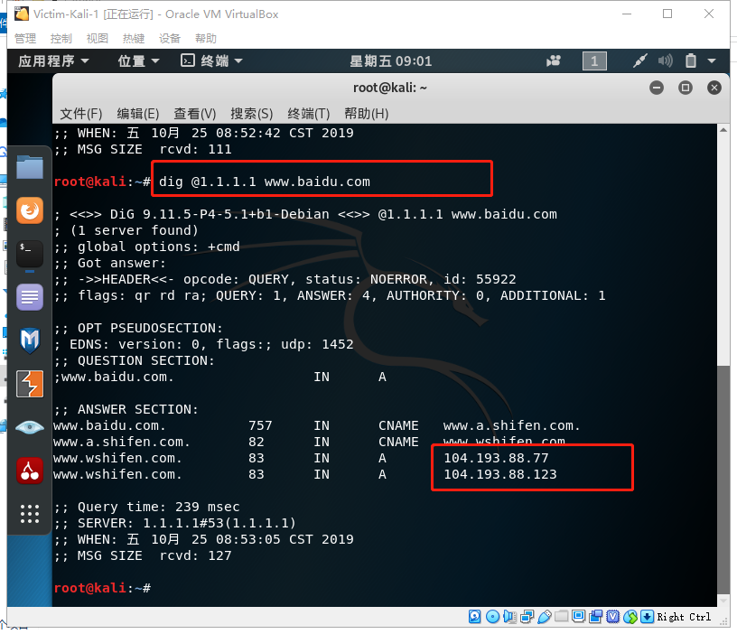
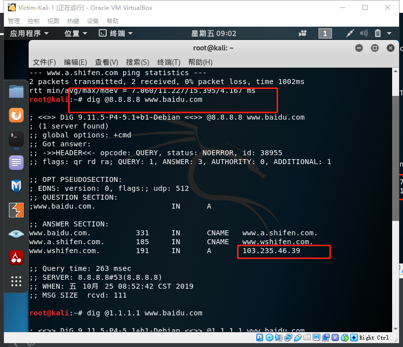
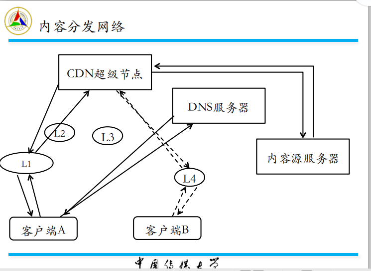
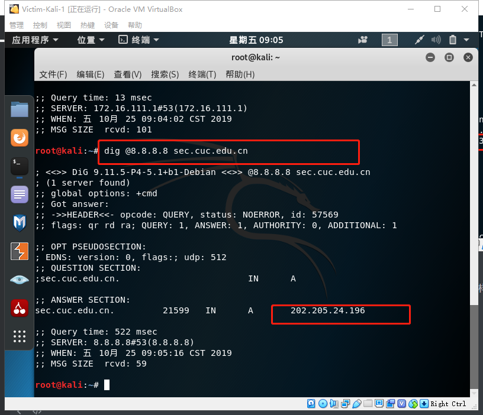
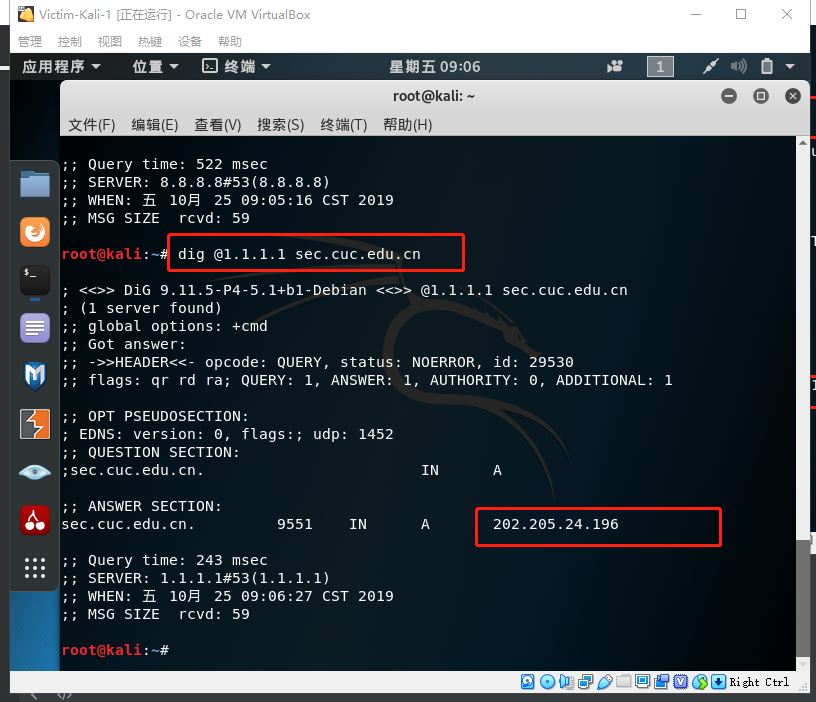
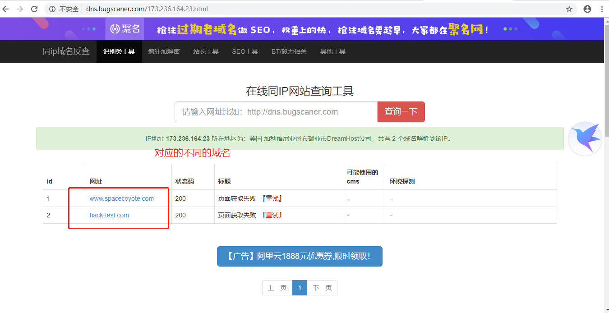
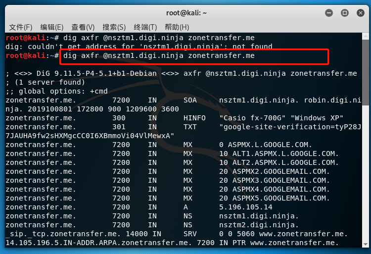
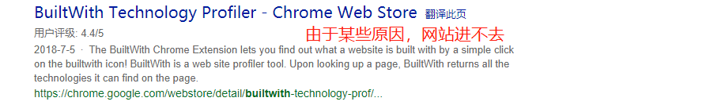

# 网络与系统渗透

## 从信息收集到入侵提权

### 实验目的

+ 通过域名获取ip收集信息从而进行入侵


### 实验先修知识

+ ```
  dig @+域名解析服务器 +域名//获取该域名的ip 
  ```

+ 可以通过一些网站[ip查询]( https://www.ipip.net/ip.html )进行源站查询，从而知道是否有CDN服务器，也可以先查看二级域名


### 实验过程

####  从域名获取 IP 

+ 通过dns解析获取百度ip，发现不同dns解析服务器对应不同的ip

  

  

+ 可以通过更换域名解析器探测镜像节点，但是如图的超级节点可以对所有经过的信息进行审查

  

+ 当然，如果我们访问只有一台服务器的域名，无论更换多少台域名，返回的地址都一样

  

  

  

####  从 IP 获取旁站 

+  有时当对目标站点一点办法都没有时，可以利用一些「IP 地址反查域名」的在线工具来获取「旁站」信息。例如除了 www.hack-test.com 之外，还有多个其他注册域名配置解析到了 [173.236.164.23](https://dns.aizhan.com/173.236.164.23/) 。对于 www.hack-test.com 来说，运行在 173.236.164.23 这一台服务器上的其他网站就被称为「旁站」。目标站点没有漏洞并不意味着该站所在的服务器上配置的其他站点也不存在漏洞，很多时候可以通过攻陷同一个 IP 上的旁站获取到系统控制权限来达到攻陷目标站点的目标。 

+ 我们使用网站` http://dns.bugscaner.com/ `，进行反查域名，可以发173.236.164.23不止对应hack-test网站，我们可以通过攻击www.sapceoyote.com的站点，从而达到攻陷目标站点

  

####  收集系统与⽹络配置详细信息 （对参考实验进行复现）

+  首先，使用dig进行传输的完整输出，输出截图和结果

  ```
  dig axfr @nsztm1.digi.ninja zonetransfer.me //域为zonetransfer.me，两个名称服务器为nsztm1.digi.ninja和nsztm2.digi.ninja
  ```

  

```

; <<>> DiG 9.11.5-P4-5.1+b1-Debian <<>> axfr @nsztm1.digi.ninja zonetransfer.me
; (1 server found)
;; global options: +cmd
zonetransfer.me.	7200	IN	SOA	nsztm1.digi.ninja. robin.digi.ninja. 2019100801 172800 900 1209600 3600
zonetransfer.me.	300	IN	HINFO	"Casio fx-700G" "Windows XP"
zonetransfer.me.	301	IN	TXT	"google-site-verification=tyP28J7JAUHA9fw2sHXMgcCC0I6XBmmoVi04VlMewxA"
zonetransfer.me.	7200	IN	MX	0 ASPMX.L.GOOGLE.COM.
zonetransfer.me.	7200	IN	MX	10 ALT1.ASPMX.L.GOOGLE.COM.
zonetransfer.me.	7200	IN	MX	10 ALT2.ASPMX.L.GOOGLE.COM.
zonetransfer.me.	7200	IN	MX	20 ASPMX2.GOOGLEMAIL.COM.
zonetransfer.me.	7200	IN	MX	20 ASPMX3.GOOGLEMAIL.COM.
zonetransfer.me.	7200	IN	MX	20 ASPMX4.GOOGLEMAIL.COM.
zonetransfer.me.	7200	IN	MX	20 ASPMX5.GOOGLEMAIL.COM.
zonetransfer.me.	7200	IN	A	5.196.105.14
zonetransfer.me.	7200	IN	NS	nsztm1.digi.ninja.
zonetransfer.me.	7200	IN	NS	nsztm2.digi.ninja.
_sip._tcp.zonetransfer.me. 14000 IN	SRV	0 0 5060 www.zonetransfer.me.
14.105.196.5.IN-ADDR.ARPA.zonetransfer.me. 7200	IN PTR www.zonetransfer.me.
asfdbauthdns.zonetransfer.me. 7900 IN	AFSDB	1 asfdbbox.zonetransfer.me.
asfdbbox.zonetransfer.me. 7200	IN	A	127.0.0.1
asfdbvolume.zonetransfer.me. 7800 IN	AFSDB	1 asfdbbox.zonetransfer.me.
canberra-office.zonetransfer.me. 7200 IN A	202.14.81.230
cmdexec.zonetransfer.me. 300	IN	TXT	"; ls"
contact.zonetransfer.me. 2592000 IN	TXT	"Remember to call or email Pippa on +44 123 4567890 or pippa@zonetransfer.me when making DNS changes"
dc-office.zonetransfer.me. 7200	IN	A	143.228.181.132
deadbeef.zonetransfer.me. 7201	IN	AAAA	dead:beaf::
dr.zonetransfer.me.	300	IN	LOC	53 20 56.558 N 1 38 33.526 W 0.00m 1m 10000m 10m
DZC.zonetransfer.me.	7200	IN	TXT	"AbCdEfG"
email.zonetransfer.me.	2222	IN	NAPTR	1 1 "P" "E2U+email" "" email.zonetransfer.me.zonetransfer.me.
email.zonetransfer.me.	7200	IN	A	74.125.206.26
Hello.zonetransfer.me.	7200	IN	TXT	"Hi to Josh and all his class"
home.zonetransfer.me.	7200	IN	A	127.0.0.1
Info.zonetransfer.me.	7200	IN	TXT	"ZoneTransfer.me service provided by Robin Wood - robin@digi.ninja. See http://digi.ninja/projects/zonetransferme.php for more information."
internal.zonetransfer.me. 300	IN	NS	intns1.zonetransfer.me.
internal.zonetransfer.me. 300	IN	NS	intns2.zonetransfer.me.
intns1.zonetransfer.me.	300	IN	A	81.4.108.41
intns2.zonetransfer.me.	300	IN	A	167.88.42.94
office.zonetransfer.me.	7200	IN	A	4.23.39.254
ipv6actnow.org.zonetransfer.me.	7200 IN	AAAA	2001:67c:2e8:11::c100:1332
owa.zonetransfer.me.	7200	IN	A	207.46.197.32
robinwood.zonetransfer.me. 302	IN	TXT	"Robin Wood"
rp.zonetransfer.me.	321	IN	RP	robin.zonetransfer.me. robinwood.zonetransfer.me.
sip.zonetransfer.me.	3333	IN	NAPTR	2 3 "P" "E2U+sip" "!^.*$!sip:customer-service@zonetransfer.me!" .
sqli.zonetransfer.me.	300	IN	TXT	"' or 1=1 --"
sshock.zonetransfer.me.	7200	IN	TXT	"() { :]}; echo ShellShocked"
staging.zonetransfer.me. 7200	IN	CNAME	www.sydneyoperahouse.com.
alltcpportsopen.firewall.test.zonetransfer.me. 301 IN A	127.0.0.1
testing.zonetransfer.me. 301	IN	CNAME	www.zonetransfer.me.
vpn.zonetransfer.me.	4000	IN	A	174.36.59.154
www.zonetransfer.me.	7200	IN	A	5.196.105.14
xss.zonetransfer.me.	300	IN	TXT	"'><script>alert('Boo')</script>"
zonetransfer.me.	7200	IN	SOA	nsztm1.digi.ninja. robin.digi.ninja. 2019100801 172800 900 1209600 3600
;; Query time: 293 msec
;; SERVER: 81.4.108.41#53(81.4.108.41)
;; WHEN: 五 10月 25 11:43:42 CST 2019
;; XFR size: 49 records (messages 1, bytes 1922)

```

+ 查看以SOA开头的信息

  ```
  zonetransfer.me.	7200	IN	SOA	nsztm1.digi.ninja. robin.digi.ninja. 2019100801 172800 900 1209600 3600
  ```

+ 此项显示有关主名称服务器的信息，管理员的联系详细信息以及其他关键信息，这是它的分解方式：

  - nsztm1.digi.ninja。-主域名服务器
  - robin.digi.ninja。-负责人，这是域负责人的电子邮件地址（先将@交换为@）
  - 2019100801-域的当前序列号。该值由辅助名称服务器检查，以查看执行增量传输（IXFR）时是否有任何条目已更改。该值通常以某种方式基于更改日期
  - 172800-次要名称服务器应该在两次更改请求之间等待的时间（秒）
  - 900-主名称服务器如果无法正确刷新，则应等待的重试时间（秒）
  - 1209600-辅助名称服务器可以声称拥有权威信息的时间（秒）
  - 3600-该域的最小TTL

+  负责人字段提供了一个电子邮件地址，可以用作其他攻击的一部分，并且从当前序列号`2019100801`开始，如果它是基于日期并定期检查的，则更改可能表示某些公司活动。 

  ```
  zonetransfer.me.	7200	IN	SOA	nsztm1.digi.ninja. robin.digi.ninja.-负责人，这是域负责人的电子邮件地址（先将@交换为@）
  ```

+  我们还可以看到操作系统和CPU版本，以下CPU版本为"casio fx-700G"，操作系统版本为"windows xp"

  ```
  zonetransfer.me.	300	IN	HINFO	"Casio fx-700G" "Windows XP"
  ```

+ `zonetransfer.me.	301	IN	TXT	"google-site-verification=tyP28J7JAUHA9fw2sHXMgcCC0I6XBmmoVi04VlMewxA"`表示该服务器经过了谷歌的验证

+  MX记录指示应将邮件发送到何处， 引导到该域名的邮件传输代理 ，这些是Google的标准邮件服务器，指示该公司使用GMail或Google Apps处理其电子邮件。 

  ```
  zonetransfer.me.	7200	IN	MX	0 ASPMX.L.GOOGLE.COM.
  ```

+  LOC是LOCation的缩写，可用于记录纬度/经度值。这些值以度/分钟/秒为单位存储，如果要在Google地图中查看这些值，则需要先将其转换为十进制。 这条记录可以看到经纬度

  ```
  dr.zonetransfer.me.	300	IN	LOC	53 20 56.558 N 1 38 33.526 W 0.00m 1m 10000m 10m
  ```

+ TXT记录是文本信息，应该始终检查有价值的信息。第一个泄露的电话号码和电子邮件地址的人显然是与系统管理有关。

  ```
  cmdexec.zonetransfer.me. 300	IN	TXT	"; ls"
  contact.zonetransfer.me. 2592000 IN	TXT	"Remember to call or email Pippa on +44 123 4567890 or 
  ```

+  该公司有一个测试站点，该站点与主站点位于同一服务器上。测试站点的安全性通常不如主要站点，因此可能是更好的攻击媒介。该公司还拥有一个登台服务器，也应该对其进行检查。 

  ```
  testing.zonetransfer.me. 301	IN	CNAME	www.zonetransfer.me.
  staging.zonetransfer.me. 7200	IN	CNAME	www.sydneyoperahouse.com.
  ```

+  PTR记录将IP地址映射回域名。 

  ```
  14.105.196.5.IN-ADDR.ARPA.zonetransfer.me. 7200	IN PTR www.zonetransfer.me.
  ```

+  SRV记录是服务记录，用于通过显示正在运行的协议，主机和端口来标识服务。这通常在VOIP设置中用于指示SIP服务器的位置，但可用于任何类型的服务。SRV记录可以显示有关目标公司正在运行的服务的一些非常有用的信息。 

  ```
  _sip._tcp.zonetransfer.me. 14000 IN	SRV	0 0 5060 www.zonetransfer.me.
  ```

  记录分解如下：

  - _sip._tcp.zonetransfer.me-服务的名称，包括协议和TCP / UDP的名称，这里是在TCP上运行的SIP
  - 14000 IN SRV-标准DNS值，TTL，DNS类和类型
  - 0-服务的优先级，如果有多个服务，则表示先尝试哪个
  - 0-权重，当两个服务具有相同的优先级时，这指示优先
  - 5060-服务正在侦听的端口
  - www.zonetransfer.me。-提供服务的主机

+ 记录是DNS记录的主要类型，通常构成大多数记录，它们将名称映射到IP地址。

  - vpn-如果您可以找到通过VPN服务器的方法，那么通常可以绕过任何现有的IDS / IPS
  - owa-通常代表Outlook Web Access，这是一个有趣的事件，因为MX记录表明该公司正在使用Google来接收其邮件，因此这可能意味着他们正在提取邮件，然后使用Exchange重新发布。我还将从中读到它们可能是Microsoft商店。
  - 办公室，canberra_office和dc_office-从这里我要说办公室是主要地点，而堪培拉和DC则是后来建立的。与办公室关联的IP上的地理位置显示总办公室在英国。我们可以从中得到两点好处，即办公室的防御能力通常不如数据中心，因此比Web或VPN服务器更好地成为目标，并且使用此位置信息可以定时进行攻击，从而使攻击效率最高。在一个漫长的周末开始的周五下班时间进行攻击，防御者可能在三天内没有注意到攻击。

  ```
  zonetransfer.me.	7200	IN	A	5.196.105.14
  www.zonetransfer.me.	7200	IN	A	5.196.105.14
  vpn.zonetransfer.me.	4000	IN	A	174.36.59.154
  owa.zonetransfer.me.	7200	IN	A	207.46.197.32
  office.zonetransfer.me.	7200	IN	A	4.23.39.254
  canberra-office.zonetransfer.me. 7200 IN A	202.14.81.230
  dc-office.zonetransfer.me. 7200	IN	A	143.228.181.132
  ```

+ 另外，有几行像是进行基本的安全测试，由此可见，域名在进行起名字的时候还是走心的，有基本的测试

  ```
  cmdexec.zonetransfer.me. 300 IN TXT "; ls" 命令执行测试 
  sqli.zonetransfer.me. 300 IN TXT "' or 1=1 --" SQL 注入漏洞测试 
  sshock.zonetransfer.me. 7200 IN TXT "() { :]}; echo ShellShocked" CVE-2014-6271 GNU Bash Shellshock 漏洞测试 payload
  xss.zonetransfer.me. 300 IN TXT "'>alert('Boo')" XSS 漏洞测试 payload
  ```

  

+ 以上，我们基本就完成了与dns域相关的详细信息的收集，我认为这是网络攻击中特别重要的一步，只有`知己知彼`,才能百战不殆嘛


#### 踩点

+  `built with`是一个网站技术信息查询工具，利用该网站所提供的功能，可以查询出某网站背后是由哪些技术来支持的，比如操作系统的类型、所采用的访问量统计服务、采用的发布平台、广告平台、语言框架、聚合功能、页面文档信息、网站编码及操作系统信息等等。 

+ 但是由于某种原因，暂时进不去该网站

  

+ 通过查看课本中的图可以发现，确实可以查询出某网站背后是由哪些技术来支持的，比如操作系统的类型、所采用的访问量统计服务、采用的发布平台、广告平台、语言框架、聚合功能、页面文档信息、网站编码及操作系统信息等等。 注意，这属于正常访问过程！

  


#### 发现漏洞

+ 由于目前漏洞基本很难发现，只是进行了技术的学习

+ 漏洞扫描⼯具 

  + ⼿⼯分析 

  + 针对开源软件：直接基于源代码分析

  + 针对闭源软件：⿊盒Fuzz测试: Fuzz（模糊测试）是一种通过提供非预期的输入并监视异常结果来发现软件安全漏洞的方法。模糊测试在很大程度上是一种强制性的技术，简单并且有效，但测试存在盲目性。 

    + [使用peach进行黑盒测试](cnblogs.com/wanglin2016/p/7647349.html)

    

#### 漏洞利用

+ 这步是在上几步的基础上进行的，可见前几步的重要性

+ 利用开放[漏洞信息库](http://www.exploit-db.com)

+ 利用自动化⼯具 

  + metasploit

  + burpsuite

+ 针对具体漏洞的定制开发漏洞利用程序

+ 维持系统控制权--上传⽊马 /创建后门账户

  + ⽹页⽊马

  + 系统级⽊马


#### 清理访问痕迹
+ 系统日志清理 
+  临时⽂件删除 
+ 后门隐藏 
  + 后门软件隐藏 
  + 后门进程隐藏 
  + 后门账户隐藏 
  + 后门端⼝隐藏


​    

### 实验结论

+ 攻击之前⼀定会有扫描⾏为—社会⼯程学⼿段、滥用第三⽅服务都可以实现信息收集⽽不留下任何扫描⾏为记录，例如我们实验中的踩点，只是正常的访问网站而已
+ 漏洞扫描和收集是漏洞利用从而进行攻击的基础，前面是基石
+ 实现安全的第一步是要懂安全，懂安全一定要懂漏洞，所以学这些并不是为了攻击而用，完全是为后面进行防御奠定基础。因此本章实验大部分在复现和理论的学习


### 实验参考资料

+ [dig收集漏洞]( https://hackertarget.com/zone-transfer/ )
+ [zone transfer me]( https://digi.ninja/projects/zonetransferme.php )
+ [builtwith]( https://trends.builtwith.com/) 


