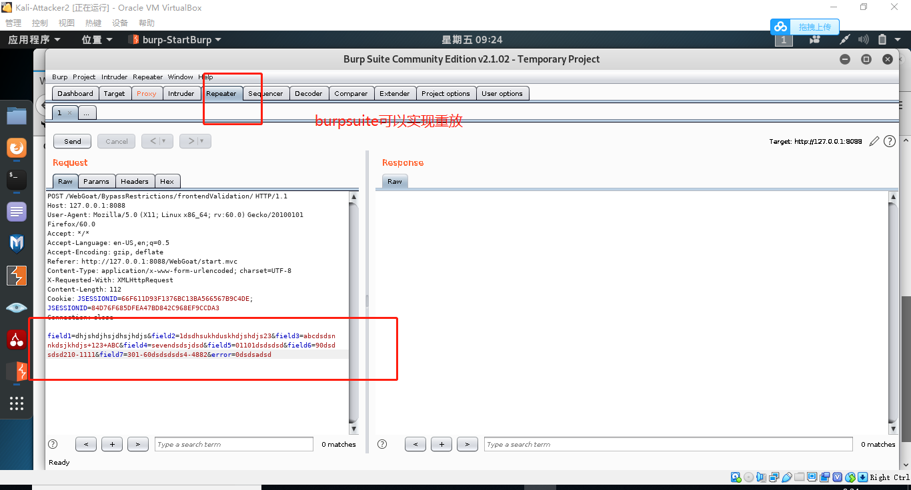
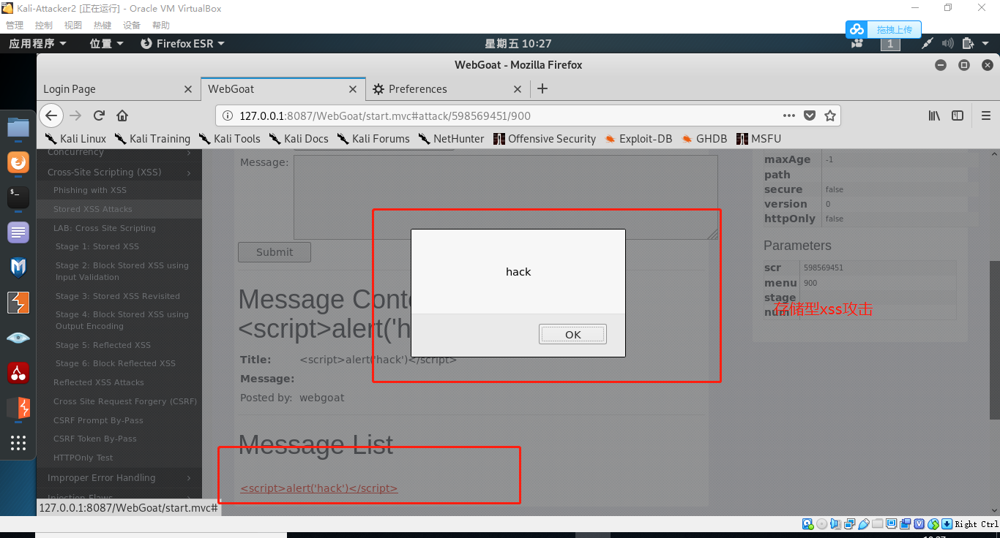
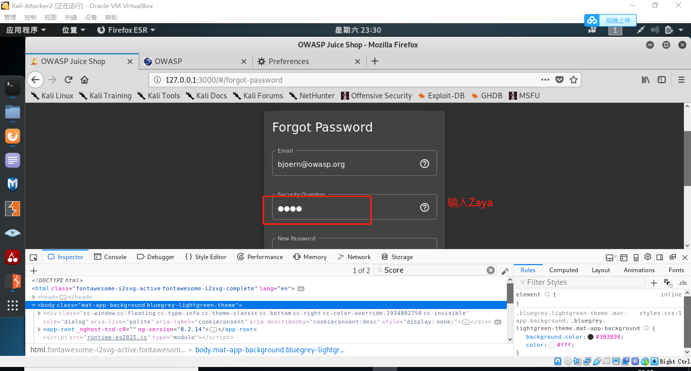
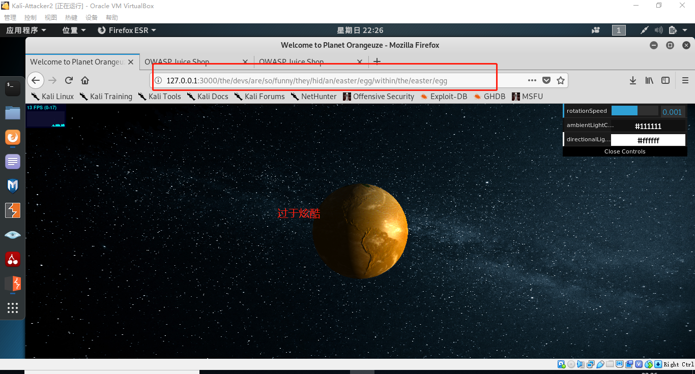

# Web 应用漏洞攻防

## 实验目的

- 了解常见 Web 漏洞训练平台；
- 了解 常见 Web 漏洞的基本原理；
- 掌握 OWASP Top 10 及常见 Web 高危漏洞的漏洞检测、漏洞利用和漏洞修复方法；

## 实验环境

- WebGoat7.1/8.0
- Juice Shop

## 实验要求（完成度）

- [x] 每个实验环境完成不少于 **5** 种不同漏洞类型的漏洞利用练习；
- [x] （可选）使用不同于官方教程中的漏洞利用方法完成目标漏洞利用练习;
- [x] （可选）**最大化** 漏洞利用效果实验；
- [x] （可选）编写 **自动化** 漏洞利用脚本完成指定的训练项目；（使用工具:burpsuite）
- [x] （可选）定位缺陷代码；
- [x] （可选）尝试从源代码层面修复漏洞；

## 实验先修知识

+ webgoat使用：`docker ps -a`可以查看运行过的容器,`docker start` 可以打开指定环境
+ 漏洞存在的⼀切罪恶都是源于恶意输⼊数据，不要相信任何来自客户端的提交数据 
+ 课件+[书本](https://c4pr1c3.github.io/cuc-ns/chap0x07/main.html)

## 实验过程

### webgoat环境下漏洞类型练习

#### 实验环境搭建(webgoat)

+ 安装dcoker-compose

  ```bash
  apt update && apt install docker-compose
  ```

  

+ 查找软件包「docker」的版本信息

   ```bash
    apt policy docker.io 
   ```
   
   
   
+ 使用老师 [提供的代码](https://github.com/c4pr1c3/ctf-games)配置环境（拼网速的过程），可以看到webgoat7.1和8.0都已下好

   ```bash
   docker-compose up -d
   ```

   

+ 至此，环境基本已经搭好，我们可以通过`docker ps `查看`webgoat`为健康状态，并且可以看到不同版本的Webgoat对应使用的端口，当然现在目前还只能在虚拟机里访问，若想要在宿主机中访问，需添加一块host-only网卡，并且需要修改`docker-compose`中的端口处，将所有对应的127.0.0.1删除，使得监听所有的端口

  
  
  
  
+ 我们可以通过登录Webgoat页面`127.0.0.1:8087/WebGoat/attack`来验证我们的7.1版本是否安装成功，以及8080端口访问验证8.0是否安装成功，我们通过guest登录上以后可以看到所有漏洞攻击类型

   

   
   
   
   
+ 顺手把dvwa的环境也搭好（虽然没来得及用）

+ dvwa环境搭建过程基本和webgoat环境搭建相同，命令如下：

   ```bash
   apt update && apt install docker-compose
   docker-compose up -d
   ```

   

+ 通过8086端口访问dvwa界面

  
  
  

#### 未验证的用户输入

+ 先登录到webgoat7.1/8.0版本界面，进行绕过前端检查实验，其实也是在感受前端检查的虚无，原理：未进行验证的用户通过修改前端代码实现前端验证的绕过`Parameter Tampering ( 1. 未验证的用户输⼊ )-->Bypass HTML Field Restrictions`


+ 先查看该实验要求，即绕过前端的检查，使得可以输入‘不合法’的字段

  

+ 打开开发者工具，查看界面代码，并观察哪里有与检查相关的信息，利用firefox的`inspector`工具可以很快的查找到对应想要的信息并按要求修改（突破限制）

  

  

  

+ webgoat8.0版本修改，这属于直接用开发者工具实验

  

+ 接下来使用`burpsuite`代理工具进行实验，这是修改前的界面
  
  
  
+ 进行修改并转发包，只需要将上述字段有所修改即可，本次实验随意修改上述字段，（界面上可直接修改）
  
+ 转发包后成功，可见前端检查真的极不安全
  
  
  
+ 继续尝试第二个绕过攻击
  
  
  
+ 使用burpsuite进行修改字段并重放，最终实现绕过前端限制攻击，原因还是未验证的用户容易实现非法输入
  
  
  
  
  
#### 脆弱的访问控制

+  准备实验环境：webgoat7.1，登录，打开 Authentication Flows --> Forgot Password 

  

+ 实验原理：内容或程序功能未能有效的保护以限制只允许合法用户的访问，使得攻击者得以利用并进行攻击，这通常是攻击者进行攻击的基本条件
  
+ 实验目的是达到获取其他用户的密码，首先进行自己信息的输入，获取到了results
  
  

+ 这次实验通过忘记密码机制可直接猜出用户喜欢的颜色，或可以通过自动化方式实现穷举攻击，`非常可怕的是`，我只是手动试了不到十次，就试出admin喜欢的颜色是green，即获取了admin的密码，原因是该网站的认证非常脆弱，没有任何锁定机制，非常容易就暴力破解了
  
  
  
  
  
  
  
  
  

#### XSS攻击

+ 准备实验环境：webgoat7.1，登录，打开xss-->phishing with xss，另外，我们可以查看界面任意元素的层级结构，原理：由于网站没有对输入内容的合法性的检测，导致用户可以输入一段可被执行的脚本或其他可执行代码

+ phishing with xss原理是：通过xss攻击获取受害者的cookie，cookie变成发送的参数发送到服务器中，这次实验的目的是获取cookie

  

+ 本次实验输入代码，即弹出一个弹窗

  ```javascript
   <script>alert('hack')</script> 
  ```

  

+ 打开实验要求网址：`http://127.0.0.1:8087/WebGoat/catcher?PROPERTY=yes`，向其发送凭证，即实验成功，相当于我们获取了之前输入的内容（脚本）

  

---

+ 准备实验环境：webgoat7.1，登录，打开xss-->phishing with xss/stored xss

  

+ 往界面中输入一段简单的脚本，并查看message list，点击，发现能弹出弹窗，并且还能弹出保护提醒窗口，原因是该网站对用户输入没有合法检查或者检查不到位导致我输入的脚本能被执行，这是很危险的，一旦输入的脚本是由危害性的，网站很有可能就遭受到攻击

  
  
  
  
+ 成功后，界面会显示` congratulations`

  
  
  
  

#### sql注入攻击

+ 准备实验环境：webgoat7.1，登录，打开injection flaws-->log spoofing

+ 原理： 就是通过把SQL命令插入到Web表单递交或输入域名或页面请求的查询字符串，最终达到欺骗服务器执行恶意的SQL命令，其实和XSS攻击有异曲同工之处

+ 我们在该网站中输入了如下sql代码

  ```sql
  %' and '0'='0 
  ```

+ 由于登录模块使用了如下的SQL查询语句，我们用来%表示所有值，这样可以获取表中的所有信息，这是由于输入的语句中包含了一个恒为真的等式，sql语句会一直执行，从而实现了sql注入攻击

  ```sql
   "select * from users where user='"\+ username + "'and password='"\+ hashedPassword + "'"
  ```

+ 最终成功实现了sql攻击

  

+ 接下来再次深入体验实验，要求是使用字符串SQL注入绕过身份验证

  

+ 其实与上述实验内容差不多，但是这次不再直接输入，使用burpsuite代理进行转发，将password改为` ' or'1'='1 `发现实验成功，原理与上一小步实验相同

  


####  脆弱认证和会话管理 

+ 准备实验环境：webgoat7.1，登录，打开 Session Management Flows --> Session Fixation 

+ 原理：由于未采用Session cookie，⽽是在URL中编码已通过认证的用户名和密码，可能会导致攻击者可以破坏密码，密钥，会话令牌或实施漏洞冒充其他用户身份， 服务器通过每个用户的唯一的Session ID 来确认其合法性。如果用户已登录，并且授权他不必重新验证授权时，当他重新登录应用系统时，他的Session ID 依然是被认为合法的。在一些程序中，可能会在GET-REQUEST 请求中传递Session ID。这就是攻击的起点。 

+ 本次实验要求输入SID，使得获取到受害者的session，即受害者一旦点击攻击者输入的cookie，并更新界面，则

  

+ 将sid输入到邮件链接中后第一阶段完成

  

  

+ 查看邮件，发现发送的邮件（受害者将收到的邮件）中包含一个链接，我们知道其中包含我们刚刚输入的SID

+ 登录受害者邮箱查收邮件，受害者点击链接，并输入用户信息，而cookie不变，但是界面内容已经变为受害者的信息界面了

  

+ 攻击者准备获取session

  

+ 攻击者只需要在链接里将SID改为开始输进去的SID，即可获得受害者的信息界面

  


### juice shop环境下漏洞类型练习

#### 实验环境搭建(juice shop)

+  相比较于现有的其他「漏洞训练」项目，本项目在产品「仿真」程度上更贴近一个「真实」应用，但是这个对初学者没有教程恐怕“无从下手”，毕竟只是一个果汁商店，juice shop环境搭建过程基本和webgoat环境搭建相同，命令如下：

   ```bash
   apt update && apt install docker-compose
   docker-compose up -d
   ```

   

+ 通过3000端口很轻松的就能访问juice shop界面，至此，环境已搭建好

  
  
+ 先进行[官方教程](https://bkimminich.gitbooks.io/pwning-owasp-juice-shop/content/part1/happy-path.html)的阅读

+ 先进行账户的注册，并使用账户登录

   


#### 第一项挑战：找到计分板

+ 由于计分板可以实时查看实验完成情况，且官方教程中的第一步就是找到计分板

+ 官方教程的要求是`找到精心隐藏的“记分板”页面`，所以界面的源代码中一定存在，只是被隐藏了，隐藏的方式无非是注释或者需要通过链接访问等等

+ 本次实验通过开发者工具的查找功能，寻找源代码直接成功，同时还可以通过ScoreBoard实时查看实验完成情况

  

  
  
  

####  第二项挑战：SQL注入攻击

+ 实验要求：使用管理员的用户帐户登录

+ 进入登录界面，准备实现利用管理员的用户账户登录，原理就是通过把SQL命令插入到Web表单递交或输入域名或页面请求的查询字符串，最终达到欺骗服务器执行恶意的SQL命令

+ 尝试使用`' and '0'='0 `sql语句进行输入，猜想这会对第一个用户进行身份验证，而第一个用户猜想是管理员

  

+ 上述尝试显示invalid name，进行第二次尝试，结果发现完成了另一项挑战：error handle，猜想原因是输入了不合法的字符串，而未被过滤
  
  
  
  
  
+ 继续Sql注入攻击，猜测管理员的邮箱并进行sql注入，密码可以是任意值

  

+ 这样sql注入确实成功了，说明这个网站对于Sql语句的输入并没有过滤机制，使得攻击者“有机可乘”

  


#### 第三项挑战：脆弱认证

+ 实验要求: 通过“忘记密码”机制重置Bjoern的OWASP帐户的密码，*并真实回答*其安全问题。 

+ 实验原理：网站对于用户的认证非常脆弱，以至于一些暴力破解就能更换某些用户的密码，一些找回密码机制也许对于忘记密码的用户是一种良药，但是对于攻击者来说很有可能成为攻击的利器

+ 先根据对网站的了解猜测Bjoern的账户，然后进行猜测他最喜欢的宠物

  

+ 发现没有好好审题，导致破解一直不成功，题目的要求是`owasp`账户的，我一直在使用juice shop的邮箱

+ 使用正确的账户，并且通过社会工程学的知识查看他以往的信息，发现他有一只猫叫'Zaya'，推测这个就是答案了

  

+ 最后发现确实成功了，这也给我们一个很大的提示，往往破解别人的密码只需要对一个人足够了解，这比任何技术都来的轻松

  


#### 第四项挑战：进阶的XSS攻击

+ 实验要求：在应用程序内的旧页面上执行XSS攻击。 

+ 原理在前一实验环境已讲过，不再赘述，先进到自己的个人信息界面

  

+  输入任何*用户名*，然后单击“ *设置用户名”*按钮。 

+ 将用户名更改为  <script>alert(`xss`)</script>  ，然后单击 *设置用户名*。

  

+ 请注意，现在在个人资料图片下显示的用户名正显示 `lert(`xss`)`在“ *用户名”*字段中 `lert(`xss`)`-都清楚表明恶意输入已被清除。显然，清理工作不是很复杂，因为输入被弄得很乱，即使关闭``标签也无法 幸免。

  

+ 将用户名更改为 <<a|ascript>alert(`xss`)</script> ，然后单击*设置用户名*。

  

+ 天真的清理程序仅删除`有效地将用户名更改为，  <script>alert(`xss`)</script>  从而导致弹出预期的警报框。这种更改非常简单

  

  

+ 显然，网站虽然有输入的检查，但是检查方式非常单一且易被发现，只要将输入的脚本稍加修改就绕过了这种检查，可见对输入单一的检测方式是万万不可取的


#### 第五项挑战：访问敏感数据

+ 实验要求： 要求访问被销售员遗忘的备份文件。 

+ 原理：由于网站对于用户数据没有很安全的维护，导致一些敏感数据暴露，最后被攻击者所持有，从而能访问到日志文件，这是很可怕的，日志文件包含一系列重要的信息

+  通过使用URL`http：// localhost：3000 / ftp`尝试浏览机密文件的目录，在这里的时候突然理解黄大的视频目录为什么是./ftp了，是很重要的文件没错了

  

+ 打开acquisition.md，查看到了机密文件，没想到偶然又完成了一项挑战

  

  

+ 查看界面，根据英文猜测以下是优惠券，点击访问发现无法直接查看，从页面信息可发现只允许.md 和 .pdf的文件允许下载。 

  

  

+ 使用截断符`%2500`暴力截断后缀名，绕过限制

  

+ 然后就获取了被遗忘的备份文件，通过了挑战

  

+ 本次实验说明敏感数据一定要有安全意识，通过加密等手段保护，否则人人都可以得到，这是及其危险的


#### 第六项挑战：存取控制中断（访问控制缺陷）

+ 实验原理：通过访问控制将用户分为普通用户和特权用户，我们通过其访问缺陷获取特权用户才能拿到的信息

+ 实验要求： 找到隐藏的复活节彩蛋。 

+ 使用访问开发人员被遗忘的备份文件中所使用的截断字攻击，下载`http：// localhost：3000 / ftp / eastere.gg％2500.md`

  

+ 然后又成功啦，获得score

  
  
+  `eastere.gg`从“ 查找隐藏的复活节彩蛋”挑战中获取加密的字符串： `L2d1ci9xcmlmL25lci9mYi9zaGFhbC9ndXJsL3V2cS9uYS9ybmZncmUvcnR0L2p2Z3V2YS9ndXIvcm5mZ3JlL3J0dA==` 
  
+  Base64解码成 `/gur/qrif/ner/fb/shaal/gurl/uvq/na/rnfgre/rtt/jvguva/gur/rnfgre/rtt`, 尝试将其作为URL无效。 

  

+  ROT13将此解码为 `/the/devs/are/so/funny/they/hid/an/easter/egg/within/the/easter/egg` ，进行访问，发现真的复活节彩蛋，太炫酷了叭！！

  

+ 成功啦

  
  
+ 至此，juice shop就告一段落啦，有缘下次继续吧
  
  
  
  

### 未验证的用户输入示例(php环境)

+ 实验理论知识
  + 设计输⼊ 
    —../ViewServlet?url=http://backendhost/images/bg.gif
  + 恶意输⼊ 
    —../ViewServlet?url=http://weblogic/console
    —../ViewServlet?url=file:///etc/passwd
    —../ViewServlet?url=../../../../../../../etc/passwd
  + 通过这个简单的应用程序可以间接实现⽂件枚
    举和后台程序扫描
+ 本次实验通过php实现了对任意文件的访问（file:///etc/passwd）
+ kali系统有自带的php


+ 编辑一段代码验证php正常使用

  ```php
  <?php
  phpinfo();
  ```

  

+ 准备好php的环境，使8000端口处于监听状态

  ```php
  php -S 127.0.0.1:8000
  ```

+ 编写php代码实现对任意文件的访问

  ```php
  <?php
  &file=$_GET['file']
  echo file_get_contents($file);
  ```

+ 在firefox中输入以下网址

  ```php
  http://127.0.0.1:8000/workspace/php/get.php?file=file:///etc/passwd
  ```

+ 发现能通过浏览器正常访问对应的文件，至此，已经通过file//伪协议实现了对任意文件的访问

  

+ 通过http://127.0.0.1:8000/workspace/php/get.php?file=../../../etc/passwd也能正常访问

  


### 定位缺陷源代码(sql注入)

+ 由于我们详细做了php实验，在网上找到一段登录界面的php源代码，猜测各大训练平台的登录代码都差不多，毕竟都存在这个漏洞体验

  ```php
  $name=$_POST['name'];
  $password=$_POST['password'];
  $sql="select * from t1 where name='$name' and password='$password'";
  $query=mysql_query($sql);
  $arr=mysql_fetch_array($query);
  if(is_array($arr))
  {
          header("Location:manager.php");
   }
  else
   {
          echo "<script>alert(您的用户名或密码输入有误);</script>";
   }
  ```

+ 我们发现登录主要使用的代码为`select * from t1 where name='$name' and password='$password'`

+  我们`<任何存在的用户名>’ or 1 #` 的话就有可能直接登录成功，我们来分析一下，当我们输入的name=’ or 1 # 时，则上面的代码就变成了

  ```php
  $sql=select * from t1 where name=' 'or 1 # ' && password='$password'
  ```

+  由于后面的内容又被我们输入的 # 给注释了，所以整个代码就变成了 

  ```php
  $sql=select * from t1 where name=' 'or 1
  ```

+  因为前面的 ’ 被我们输入的 ’ 给闭合了，而 or 1 本身就为真，则整个语句就为真，所以整个代码就等价于

  ```php
  $sql=selsect * from t1
  ```

+  按照上面这段代码就可以直接登录成功了，甚至都不用知道存在的用户是什么，直接把输入改为`'or 1 #`，即可登录成功


### 尝试从源代码层面修复上述漏洞

+ 上述源代码的漏洞核心我认为在判断语句

  ```php
  if(is_array($arr))
  ```

+ 这个判断过于简单，将其改为，对于password有详细的判断，则上述漏洞使用方法将不再成功

  ```php
  if($arr['name']===$name && $arr['password']===$password)
  ```

+ 另外，这个代码还存在另外的缺陷，攻击者有机会注入XSS代码等进入数据库，这非常危险，我们把数据库的数据先取出来，在进行数据比较，避免直接对数据库进行操作

  ```php
  $query="select * from t2 ";
  	$result=mysqli_query($link,$query);
  	$a=0;
  	while($colum=mysqli_fetch_array($result))
  	{
  		if($colum['name']===$_POST['name'] && $colum['password']===$_POST['password'])
  			{
  				$a++;
  				break;
  			}
  	}
  ```

+ 此外，还可以在前端代码进行一些输入限制（例如max length等等)，虽然这在“黑客”眼中约等于没有限制，但是有限制总是给攻击加大了难度嘛


### 进阶的XSS攻击（在自己写的网站中进行实验）（最大化？）

#### 实验环境

+ mysql+php+apache

#### 实验代码

```php+HTML
//前端
<html>
<head lang="en">
    <meta charset="UTF-8">
    <title>XSS</title>
</head>
<body>
    <form action="action2.php" method="post">
       ID  <input type="text" name="id" /> <br/>
        Name<input type="text" name="name" /> <br/>
        <input type="submit" value="submit">
    </form>
</body>
</html>
//后端：action2.php
<?php
	$id=$_POST["id"];
	$name=$_POST["name"];
	$con=mysqli_connect("localhost","root","123456");
	mysqli_select_db($con,"test");
	
	$sql="insert into xss value ($id,'$name')";
	$result=mysqli_query($con,$sql);
?>
//供其他用户访问页面：show2.php
<?php
	$con=mysqli_connect("localhost","root","123456");
	mysqli_select_db($con,"test");
	$sql="select * from xss where id=1";
	$result=mysqli_query($con,$sql);
	while($row=mysql_fetch_array($result)){
		echo $row['name'];
	}
?>

```

#### 实验过程

+ 这里有一个用户提交的页面，数据提交给后端之后，后端存储在数据库中。然后当其他用户访问另一个页面的时候，后端调出该数据，显示给另一个用户，XSS代码就被执行了 

  

+ 我们输入 1  和 `<script>alert(\'hack\')</script> ` ，注意，这里的hack的单引号要进行转义，因为sql语句中的$name是单引号的，所以这里不转义的话就会闭合sql语句中的单引号。不然注入不进去。提交了之后，我们看看数据库 ，这是navicat中的可视化数据

  

+ 然后当其他用户访问 show2.php 页面时，我们插入的XSS代码就执行了，也就意味着我们存储型XSS攻击成功了 

  

+  这相当于把php漏洞利用和xss攻击进行简易的结合，且这是真实但可控的环境中，这说明前面体验的漏洞真实环境中是存在的，并且很常见的，只要安全防护一不仔细，就很可能被利用

  

### 自动化脚本漏洞攻击（使用burpsuite）

+ 使用burpsuite自动化（程序员太懒了，一旦有了现成的工具就...)，进一步改进sql注入-->拒绝服务攻击

  

+ 在burpsuite设置断点

  

+ 我们想使用不同于上面的直接sql注入进行攻击，我们想使用`1'order by n --`，但是不确定n是几，需要通过自动化编写来实现

+ 使用burpsuite的[intruder](https://blog.csdn.net/u011781521/article/details/54772795)来实现自动化

  

+ 对n进行枚举,从1到15

  

  

  

+ 开始攻击，这比手动尝试快多啦，这也是为什么需要自动化的原因

  

+ 其实这个很适合拒绝服务攻击，我们试试向服务器发n（1000）个包

  

+ 目前服务器还能应付的过来，但是试想，我们如果发送更多的包呢？是不是有可能使服务器直接瘫痪，这可要修复好一段时间了


## 实验所遇问题与解决方法

+ 搭建环境安装docker-compose时出现`Couldn't connect to Docker daemon at http+docker://localhost - is it running?`的报错

  解决办法：启动docker` systemctl start docker`即解决

+ linux系统的命令非常不熟悉，每用一个都要查文档，每次做实验都在灵魂质问：到底为什么不先上linux系统再上这个课程呢？
  
  [linux命令](https://www.runoob.com/linux/linux-command-manual.html)
  
+ 使用webgoat8.0访问页面的时候一直出错，是由于webgoat版本有漏洞，老师一开始给的代码配置会出错
  
  解决方法：将第三章实验所用代理取消
  
+ webgoat8.0注册失败，代码后面加`--force-recreate`重新加载，清空缓存
  
  ```
  docker stop webgoat8-db && docker rm webgoat8-db && docker-compose up -d --force-recreate
  ```
  
+ burpsuite在juice shop实验过程中一直用不了，后来发现是端口被占用了，改一个端口即解决了，查看端口占用命令如下

  ```bash
  netstat -tunlp | grep 80
  ```

  


## 实验总结

+ 前端绕过实验：客户端的验证极不安全，非常容易就能修改并绕过前端的检查，要想实现安全，一定要在服务器段进行验证用户身份，比较安全的方式是设置白名单访问方式

+ burpsuite是一款非常强大的代理工具，功能太实用，是实验的“好助手”

+ 其实个人认为webgoat的漏洞还是非常全面的，但是存在很多巧合性，实验也许不需要真实的利用漏洞，只需要利用其内在的判题机制缺陷即可完成漏洞实验

+ xss攻击类型总结
  + 存储型XSS：存储型XSS，持久化，代码是存储在服务器中的，如在个人信息或发表文章等地方，插入代码，如果没有过滤或过滤不严，那么这些代码将储存到服务器中，用户访问该页面的时候触发代码执行。这种XSS比较危险，容易造成蠕虫，盗窃cookie
  + 反射型XSS：非持久化，需要欺骗用户自己去点击链接才能触发XSS代码（服务器中没有这样的页面和内容），一般容易出现在搜索页面。反射型XSS大多数是用来盗取用户的Cookie信息
  + DOM型XSS：不经过后端，DOM-XSS漏洞是基于文档对象模型(Document Objeet Model,DOM)的一种漏洞，DOM-XSS是通过url传入参数去控制触发的，其实也属于反射型XSS
  
+ 各种常用漏洞类型原理及解决办法总结

  | 漏洞类型           | 主要成因                                                     | 解决办法（理论，代表性）                                     |
  | ------------------ | ------------------------------------------------------------ | ------------------------------------------------------------ |
  | 未验证的用户输⼊   | 网站只在客户端进⾏输⼊验证，过滤时未进⾏规范化               | 服务器返回给客户端的重要参数、赋值使用，HMAC进⾏参数签名     |
  | 缓冲区溢出         | 应用程序的缓冲区中存在过量的输⼊数据，溢出的数据中包含恶意指令且恶意指令被精确填充到可执⾏堆/栈（内存）中进⽽导致恶意代码被执⾏ | 避免使用本地代码，避免直接调用本地应用程序，Java虚拟机的安全更新补丁，PHP语⾔的安全更新补丁限制Web应用程序的运⾏权限 |
  | sql注入            | 登录模块使用了如下的SQL查询语句，很容易被用户输⼊破解登录功能 | 在任何时候避免直接使用外部的解释器，⽽使用编程语⾔提供的API库，在将数据发送给后台程序时对数据进⾏编码 |
  | XSS攻击            | 攻击者将恶意脚本代码发送到终端用户的浏览器                   | 要确保用户不能提交恶意脚本代码                               |
  | 不恰当的错误处理   | 程序的错误消息会暴露程序的⼀些实现细节                       | 定义⼀套清晰和⼀致的错误处理机制等                           |
  | 脆弱的访问控制     | 内容或程序功能未能有效的保护以限制只允许合法用户的访问       | 对每个需要保护的请求进⾏检查，不仅是在用户第⼀次请求时进⾏检查等 |
  | 脆弱认证和会话管理 | 未采用Session cookie，⽽是在URL中编码已通过认证的用户名和密码 | 使用强认证机制                                               |
  | 不安全的存储       | 敏感/重要的数据未采取安全的存储⽅式                          | 仅存储那些必须存储的数据，不允许对后台应用程序的直接访问，不要在Web应用程序服务器所在的根目录存储重要⽂件 |
  | 不安全的配置管理   | 未及时更新安全补丁等                                         | 为每一个服务器创建一个安全标准                               |
  | 拒绝服务攻击       | Web应用程序非常容易遭受拒绝服务攻击，这是由于Web应用程序本身⽆法区分正常的请求通信和恶意的通信数据 | 避免可能会导致资源密集性消耗的请求                           |
  | 跨站点请求伪造     | 利用站点已验证通过的用户会话                                 | 使用GET⽅法进⾏查询操作，使用POST⽅法进⾏更新操作            |
  | PHP的⽂件包含漏洞  | PHP代码的⽂件包含指令中含有动态变量参数， 该参数会被攻击者恶意控制实现动态包含任意⽂件 | 严格检查变量是否已经初始化                                   |
  | ⽂件上传漏洞       | 允许用户上传⽂件可能会让⿊客上次恶意文件                     | 定义⽂件名白名单，上传文件后统一命名                         |

  


## 实验参考资料

+ [linux命令](https://www.runoob.com/linux/linux-command-manual.html)
+ [docker-compose报错解决](https://blog.csdn.net/yahohi/article/details/84500856)
+ [vulhub](https://vulhub.org/)
+ [cheat sheet](https://www.owasp.org/index.php/XSS_Filter_Evasion_Cheat_Sheet)
+ [xss攻击总结](https://blog.csdn.net/qq_36119192/article/details/82469035)
+ [OWASP TOP 10 漏洞的原理与危害](https://blog.csdn.net/FHLZLHQ/article/details/82151030)
+ [juice shop](https://bkimminich.gitbooks.io/pwning-owasp-juice-shop/content/)
+ [漏洞原理讲解](https://blog.csdn.net/weixin_44300286/article/details/89608723)
+ [php学习](https://www.runoob.com/php/php-tutorial.html)
+ [burpsuite intruder](https://blog.csdn.net/u011781521/article/details/54772795)


