# 防火墙配置与使用

## 实验目的

+ 进行防火墙的配置与使用，理解防火墙的原理规则等

## 实验先修知识

+ iptables基本命令使用

  ```bash
  iptables -h #简易帮助
  iptables [-t表名] <-L> [链名] #查看iptables规则
  #–[-t表名],查看哪个表的规则列表
  #–-L,查看指定表指定链的规则列表
  #–链名,查看指定表中哪个链的规则链表
  iptables -L -n -t filter -v #查看iptales的三个链（转发链，input和output链
  iptables.rules #查看防护墙配置规则
  iptables-restore <iptables.rules #iptables-restore命令用来还原iptables-save命令所备份的iptables配置。
  ssh 172.16.111.1 -vv#查看ssh服务
  ```

+ iptables核心指令格式

  ```bash
  iptables [-t 表] 命令 匹配 操作
  ```

  其中表选项，指定命令应用于哪个内置表(filter表、nat表或mangle表)，命令选项则如表8-1所示，匹配选项如表8-2所示，动作选项为表8-3所示，

  | 命令                 | 说明                               |
  | :------------------- | :--------------------------------- |
  | -P或--policy <链名>  | 定义默认策略                       |
  | -L或--list <链名>    | 查看iptables规则列表               |
  | -A或--append <链名>  | 在规则列表的最后增加1条规则        |
  | -I或--insert <链名>  | 在指定的位置插入1条规则            |
  | -D或--delete <链名>  | 从规则列表中删除1条规则            |
  | -R或--replace <链名> | 替换规则列表中的某条规则           |
  | -F或--flush <链名>   | 删除表中所有规则                   |
  | -Z或--zero <链名>    | 将表中数据包计数器和流量计数器归零 |

  表8-1 命令选项表

  | 匹配               | 说明                                                         |
  | :----------------- | :----------------------------------------------------------- |
  | -i<网络接口名>     | 指定数据包从哪个网络接口进入，如ppp0、eth0和eth1等           |
  | -o<网络接口名>     | 指定数据包从哪块网络接口输出，如ppp0、eth0和eth1等           |
  | -p<协议类型>       | 指定数据包匹配的协议，如TCP、UDP和ICMP等                     |
  | -s<源地址或子网>   | 指定数据包匹配的源地址                                       |
  | --sport <源端口号> | 指定数据包匹配的源端口号，可以使用“起始端口号:结束端口号”的格式指定一个范围的端口 |
  | -d<目标地址或子网> | 指定数据包匹配的目标地址                                     |
  | --dport目标端口号  | 指定数据包匹配的目标端口号，可以使用“起始端口号:结束端口号”的格式指定一个范围的端口 |

  表8-2 匹配选项表

  | 动作       | 说明                                                         |
  | :--------- | :----------------------------------------------------------- |
  | ACCEPT     | 接受数据包                                                   |
  | DROP       | 丢弃数据包                                                   |
  | REDIRECT   | 将数据包重新转向到本机或另一台主机的某个端口，通常用功能实现透明代理或对外开放内网某些服务 |
  | SNAT       | 源地址转换，即改变数据包的源地址                             |
  | DNAT       | 目标地址转换，即改变数据包的目的地址                         |
  | MASQUERADE | IP伪装，即是常说的NAT技术，MASQUERADE只能用于ADSL等拨号上网的IP伪装，也就是主机的IP是由ISP分配动态的；如果主机的IP地址是静态固定的，就要使用SNAT |
  | LOG        | 日志功能，将符合规则的数据包的相关信息记录在日志中，以便管理员的分析和排错 |

  表8-3 动作选项表


## 实验环境准备

- 虚拟机使用 NAT + Internal / Host-only 方式联网，安装 proftpd / Apache2
- 使用 stand alone 模式启动 proftpd
- 配置 proftpd 支持匿名访问


## 实验拓扑图

+ 网关和victim默认可以互相访问

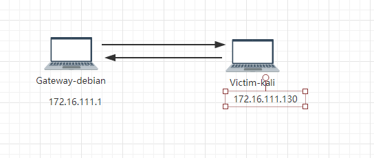


## 实验过程

### iptables配置实例

+ 基本使用

  ```bash
  # （1）传输层防护实例
  
  # 禁止其它机器通过ssh连接自己
  
  iptables -t filter -A INPUT -p tcp --dport 22 -j DROP
  
  # 查看主机防火墙规则
  
  iptables -t filter -L
  
  # 防止各种端口扫描
  
  # 以下规则设定，假设 FORWARD 链默认规则为 DROP 
  # 限制 SYN 请求的频率为：每秒 1 个
  # tcp-flags 的第一个参数 ALL 表示检查 TCP 的所有状态标志位
  # ALL 等价于 SYN,ACK,FIN,RST,URG,PSH （顺序无关，这是一个集合匹配）
  # tcp-flags 的第二个参数 SYN 表示仅匹配设置了 SYN 标志位的报文
  # 其中参数--limit 1/s 表示每秒一次; 1/m 则为每分钟一次
  iptables -A FORWARD -p tcp --tcp-flags ALL SYN -m limit --limit 1/s -j ACCEPT
  
  # 禁止 XMAS 扫描
  iptables -A INPUT -p tcp --tcp-flags ALL FIN,PSH,URG -j DROP
  
  # 记录 XMAS 扫描到系统日志
  iptables -A INPUT -p tcp --tcp-flags ALL FIN,PSH,URG -m limit --limit 3/m --limit-burst 5 -j LOG --log-prefix "XMAS scan "
  
  # 限制 ping 20 秒内不得超过 6 次
  iptables -A INPUT -p icmp --icmp-type echo-request -m recent --name ICMP_check --rcheck --seconds 20 --hitcount 6 -j DROP
  iptables -A INPUT -p icmp --icmp-type echo-request -m recent --set --name ICMP_check
  # 以下是示例测试结果
  #PING 192.168.56.104 (192.168.56.104) 56(84) bytes of data.
  #64 bytes from 192.168.56.104: icmp_seq=1 ttl=64 time=0.237 ms
  #64 bytes from 192.168.56.104: icmp_seq=2 ttl=64 time=0.426 ms
  #64 bytes from 192.168.56.104: icmp_seq=3 ttl=64 time=0.557 ms
  #64 bytes from 192.168.56.104: icmp_seq=4 ttl=64 time=0.416 ms
  #64 bytes from 192.168.56.104: icmp_seq=5 ttl=64 time=0.478 ms
  #64 bytes from 192.168.56.104: icmp_seq=6 ttl=64 time=0.371 ms
  #64 bytes from 192.168.56.104: icmp_seq=21 ttl=64 time=0.380 ms
  #64 bytes from 192.168.56.104: icmp_seq=22 ttl=64 time=0.553 ms
  #64 bytes from 192.168.56.104: icmp_seq=23 ttl=64 time=0.424 ms
  #64 bytes from 192.168.56.104: icmp_seq=24 ttl=64 time=0.377 ms
  #64 bytes from 192.168.56.104: icmp_seq=25 ttl=64 time=0.334 ms
  #64 bytes from 192.168.56.104: icmp_seq=26 ttl=64 time=0.370 ms
  #64 bytes from 192.168.56.104: icmp_seq=41 ttl=64 time=0.397 ms
  
  # 禁止自己主机使用FTP协议下载（即封闭TCP协议的21端口）
  
  iptables -I OUTPUT -p tcp --dprot 21 -j DROP
  
  # 禁用主机的DNS端口(DNS为UDP协议，使用53端口)
  
  iptables -I OUTPUT -p udp --dport 53 -j DROP
  
  # （2）网络层防护实例
  
  # 防止ping洪水攻击。例如，限制ping的并发数，每秒一次。
  # 在 FORWARD 链上设置规则说明 iptables 所在主机是一个网关，可以限制内网主机去扫外网其他主机
  # 如果在 INPUT 链上设置规则，则说明 iptables 保护的是主机自己
  # FORWARD 上设置的这种限速措施可以理解为是从攻击源头进行治理，预防从自己管的这个片区出去的犯罪行为
  iptables -A FORWARD -p icmp --icmp-type echo-request -m limit --limit 1/s -j ACCEPT
  
  # 限制一个ip访问自己主机。例如，以下这条命令限制了ip地址为192.168.1.102主机对自己的访问。
  
  iptables -A INPUT -s 192.168.1.102 -j DROP
  
  # （3）数据链路层防护实例
  
  # 阻断来自某个mac地址的数据包
  
  iptables -A INPUT -m mac --mac-source 00:1e:ec:f0:ae:77 -j DROP
  
  # 上面的命令阻断了mac地址为00:1e:ec:f0:ae:77 对本机的连接。
  
  # 查看本机iptables表
  iptables -L -n
  iptables -L -n -t nat
  ```

+ 禁止指定 IP 访问

```bash
#!/bin/bash

# iptables script generated 2011-10-13
# http://www.mista.nu/iptables

IPT="/sbin/iptables"

# Flush old rules, old custom tables
$IPT --flush
$IPT --delete-chain

# Set default policies for all three default chains
$IPT -P INPUT DROP
$IPT -P FORWARD DROP
$IPT -P OUTPUT ACCEPT

# Enable free use of loopback interfaces
$IPT -A INPUT -i lo -j ACCEPT
$IPT -A OUTPUT -o lo -j ACCEPT

# All TCP sessions should begin with SYN
$IPT -A INPUT -p tcp ! --syn -m state --state NEW -s 0.0.0.0/0 -j DROP

# Accept inbound TCP packets
$IPT -A INPUT -m state --state ESTABLISHED,RELATED -j ACCEPT

# Block a specific IP address
$IPT -A INPUT -p IP -s 192.168.56.1 -j DROP
```

+ 禁止 TCP / UDP 指定端口访问

```bash
#!/bin/bash

# iptables script generated 2011-10-13
# http://www.mista.nu/iptables

IPT="/sbin/iptables"

# Flush old rules, old custom tables
$IPT --flush
$IPT --delete-chain

# Set default policies for all three default chains
$IPT -P INPUT DROP
$IPT -P FORWARD DROP
$IPT -P OUTPUT ACCEPT

# Enable free use of loopback interfaces
$IPT -A INPUT -i lo -j ACCEPT
$IPT -A OUTPUT -o lo -j ACCEPT

# All TCP sessions should begin with SYN
$IPT -A INPUT -p tcp ! --syn -m state --state NEW -s 0.0.0.0/0 -j DROP

# Accept inbound TCP packets
$IPT -A INPUT -m state --state ESTABLISHED,RELATED -j ACCEPT


$IPT -A INPUT -p tcp --dport 22 -m state --state NEW -s 0.0.0.0/0 -j DROP

# 通过在源和目的主机(防火墙所在主机)上抓包，对比DROP和REJECT指令在防火墙响应行为上的差异
#$IPT -A INPUT -p tcp --dport 22 -m state --state NEW -s 0.0.0.0/0 -j REJECT
```

+ 禁止 ICMP ping

```bash
#!/bin/bash

# iptables script generated 2011-10-13
# http://www.mista.nu/iptables

IPT="/sbin/iptables"

# Flush old rules, old custom tables
$IPT --flush
$IPT --delete-chain

# Set default policies for all three default chains
$IPT -P INPUT DROP
$IPT -P FORWARD DROP
$IPT -P OUTPUT ACCEPT

# Enable free use of loopback interfaces
$IPT -A INPUT -i lo -j ACCEPT
$IPT -A OUTPUT -o lo -j ACCEPT

# All TCP sessions should begin with SYN
$IPT -A INPUT -p tcp ! --syn -m state --state NEW -s 0.0.0.0/0 -j DROP

# Accept inbound TCP packets
$IPT -A INPUT -m state --state ESTABLISHED,RELATED -j ACCEPT

# DROP inbound ICMP messages
$IPT -A INPUT -p ICMP --icmp-type 8 -s 0.0.0.0/0 -j DROP
```

+ 在victim访问外网之前使用`iptables -L -n -t filter -v`查看chain的状态，发现包的数量都为0 

  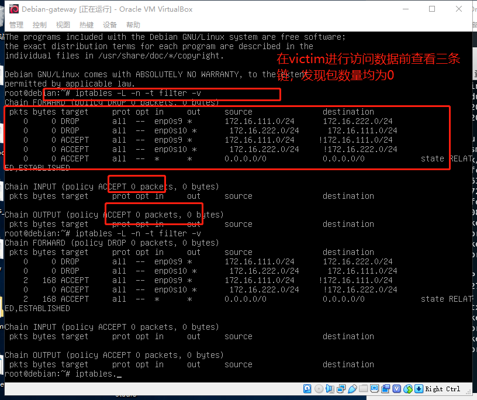

+ victim对`sec.cuc.edu.cn`进行ping，发现gateway中forward chain中多了两个包，即刚刚转发的两个包

  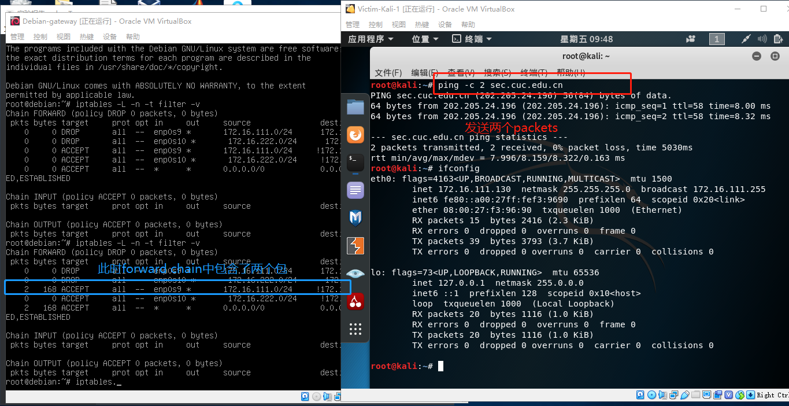

+ 这也同时说明了流量经过了网关

+ iptables规则编辑

  ```bash
  # 导出当前防火墙规则到文件
  iptables-save > iptables.rules
  
  # 备份当前规则文件
  cp iptables.rules iptables.rules.bak
  
  # 用文本编辑器编辑上一步备份出来的当前 iptables 规则文件的副本 iptables.rules
  
  # 应用编辑后的防火墙规则
  # -c  指定在还原 iptables 时候，重置当前的数据包计数器和字节计数器的值为零
  iptables-restore < iptables.rules
  
  # 随时可以使用之前备份的 iptables.rules.bak 来重置回最近一次没问题的规则
  ```

+ 我们根据上述指令查看到了默认的iptables规则

  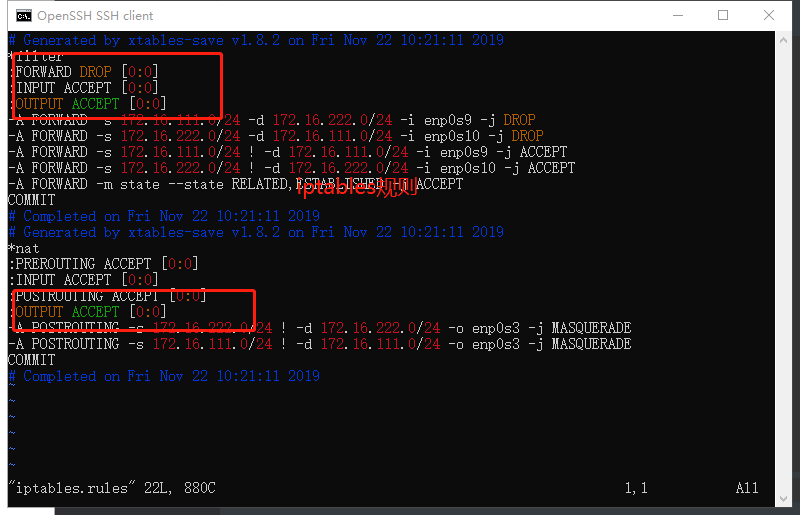

### 网络层

+ 使用以下代码进行icmp包drop，禁止icmp`ping`，并保存

  ```bash
  $IPT -A INPUT -p ICMP --icmp-type 8 -s 0.0.0.0/0 -j DROP
  ```

  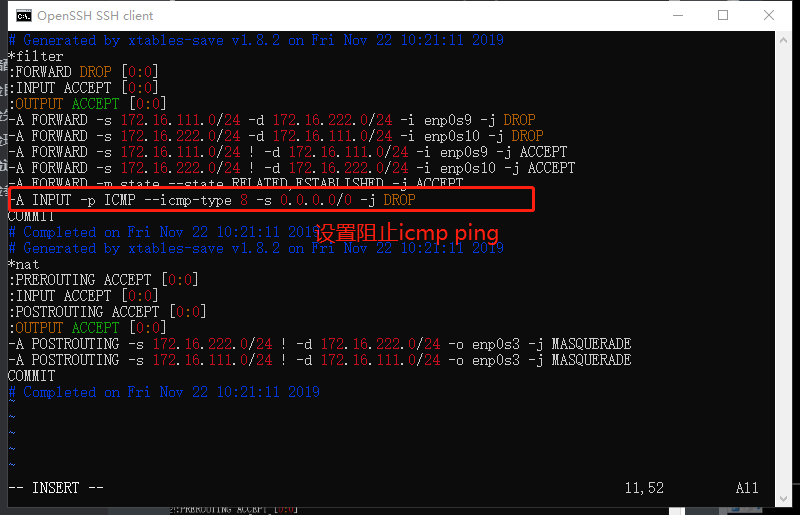

  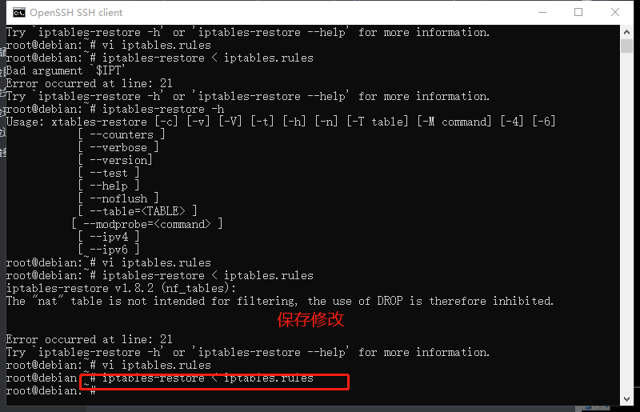

+ 发现victim ping不通主机但是能ping通外网，说明我们的设置确实生效了，因为forward我们并未设置，只设置了input链的drop,所以能正常访问

  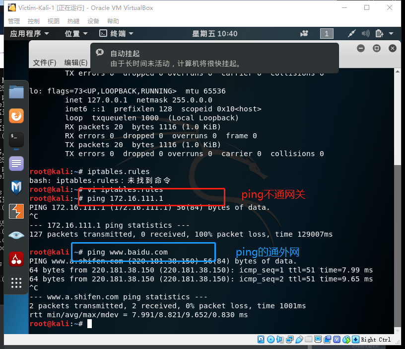

+ 使用以下代码对指定ip的ip包drop,转回debian的原因是ssh突然断了连接

  ```bash
  $IPT -A INPUT -p IP -s 192.168.56.1 -j DROP
  ```

  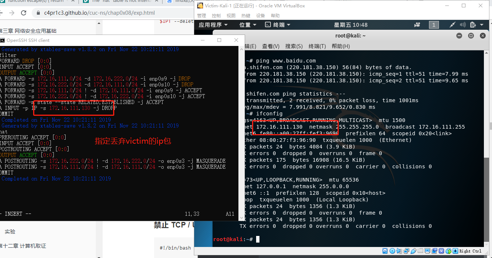

  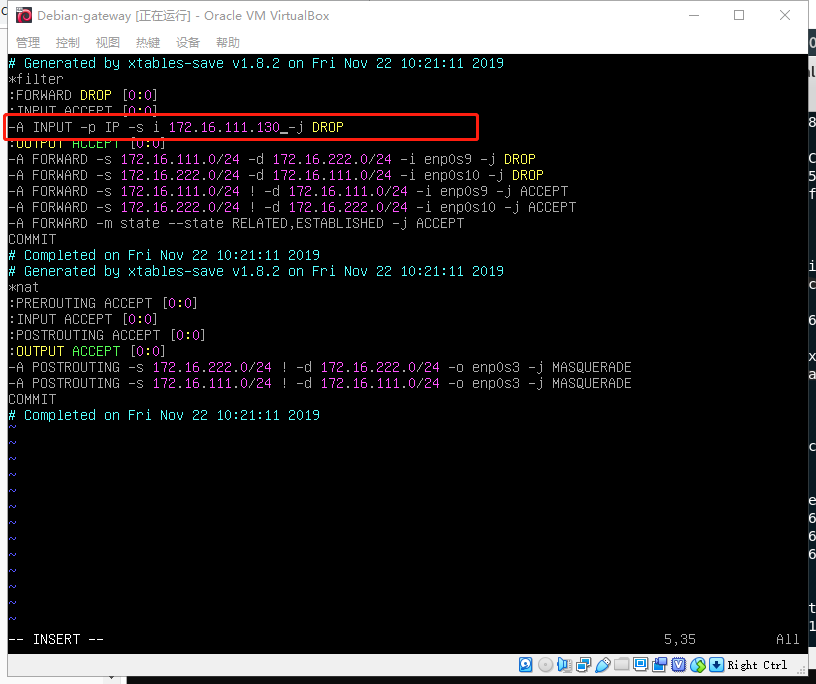

+ 发现victim确实ping不通主机了

  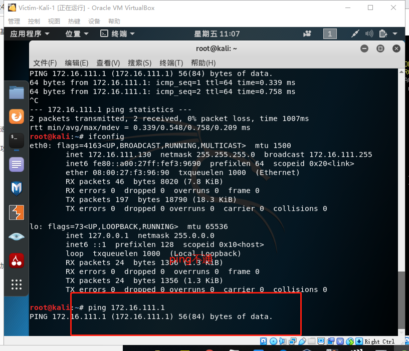

+ 查看iptables状态，发现确实被drop了

  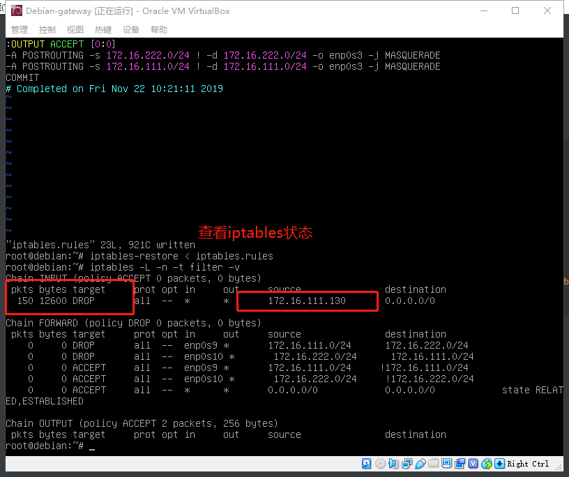
  
### 传输层

+ 设置防火墙规则以禁止其它机器通过ssh连接自己

  ```bash
  # （1）传输层防护实例
  iptables -t filter -A INPUT -p tcp --dport 22 -j DROP
  ```

  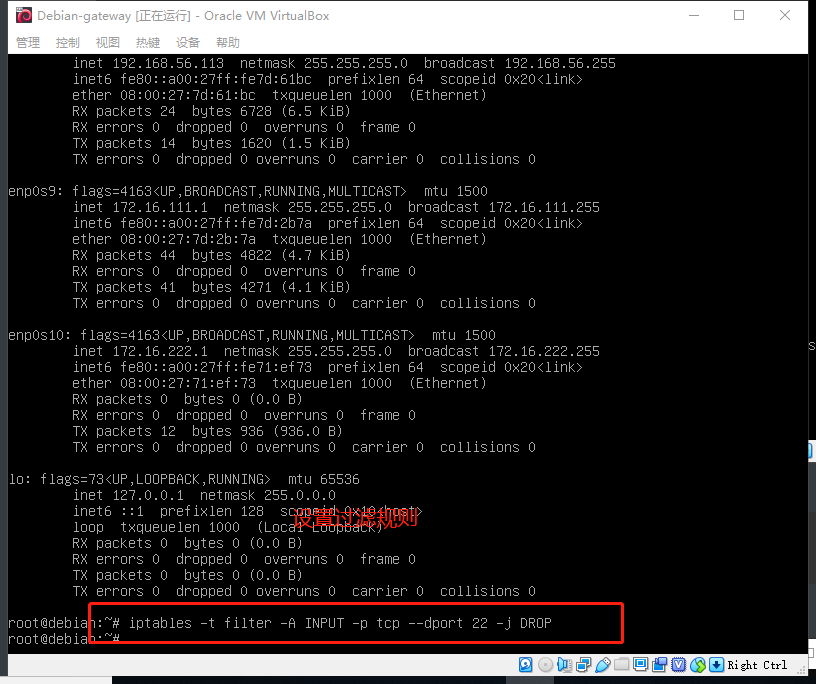

+ 在设置之前发现ssh能远程登录

  

+ 然后发现远程登录被驱逐，说明我们的过滤规则确实发生了作用

  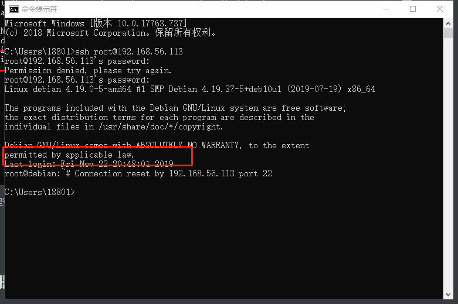

+ 为了进一步证明上述规则，我们把刚刚那条规则删去以后，发现又可以进行ssh远程登录了

  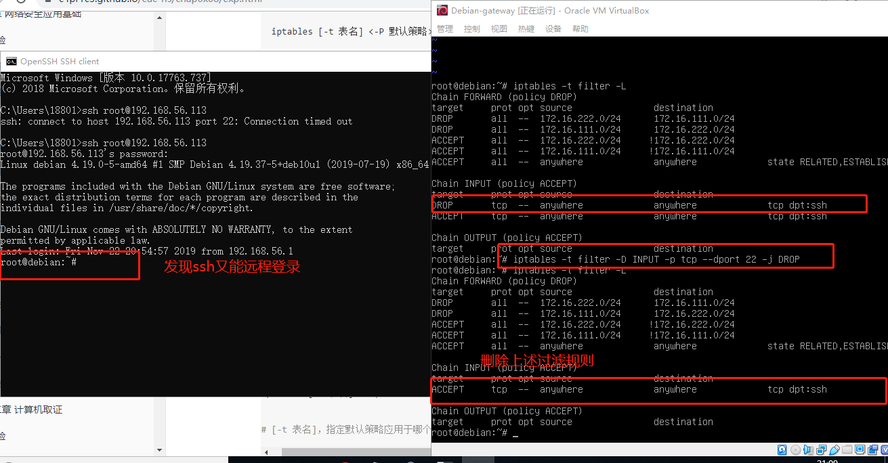

### 数据链路层

+ 阻断来自某个mac地址的数据包

  ```bash
  iptables -A INPUT -m mac --mac-source 08:00:27:f3:96:90 -j DROP
  
  # 上面的命令阻断了mac地址为08:00:27:f3:96:90(victim) 对本机的连接。
  ```

  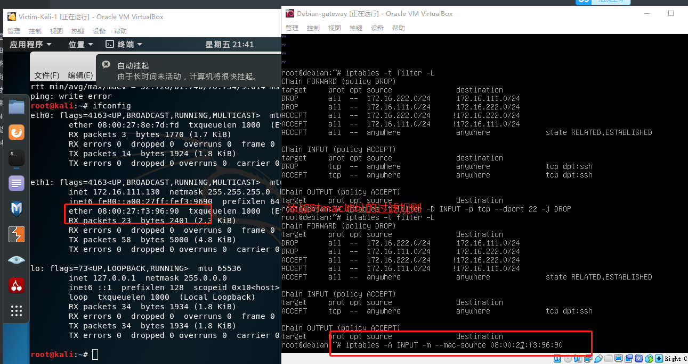

+ 发现确实victim不再能访问网关，但是不影响其访问别的外网，原因同上面，这只过滤了INPUT链的而不是转发链

  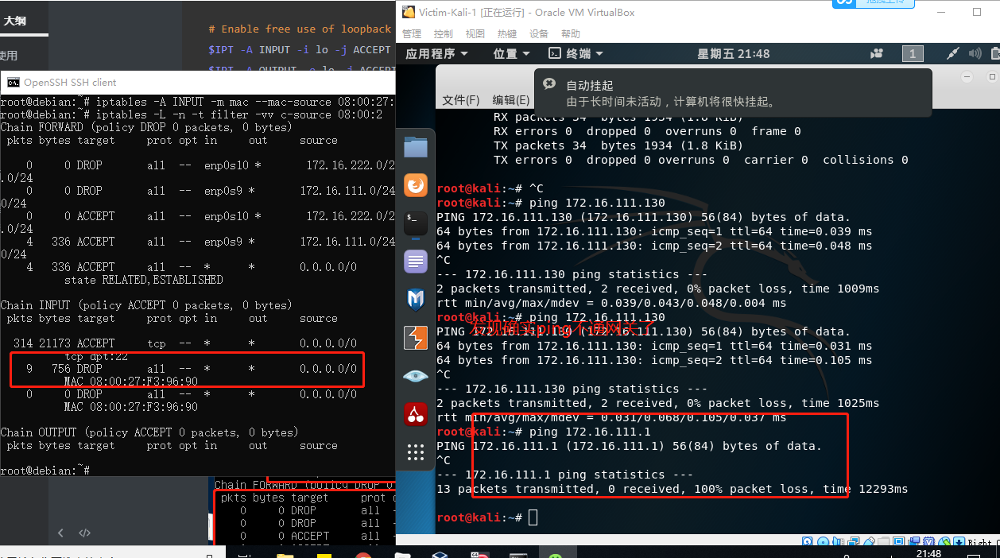


### 应用层

+ 匹配应用层指定字符串

+ 输入以下String限制规则

  ```bash
  $IPT -A INPUT -p tcp -m string --algo bm --string 'Apache' -j REJECT --reject-with tcp-reset
  ```

+ 在未添加过滤规则时，victim可以直接通过apache访问网关

  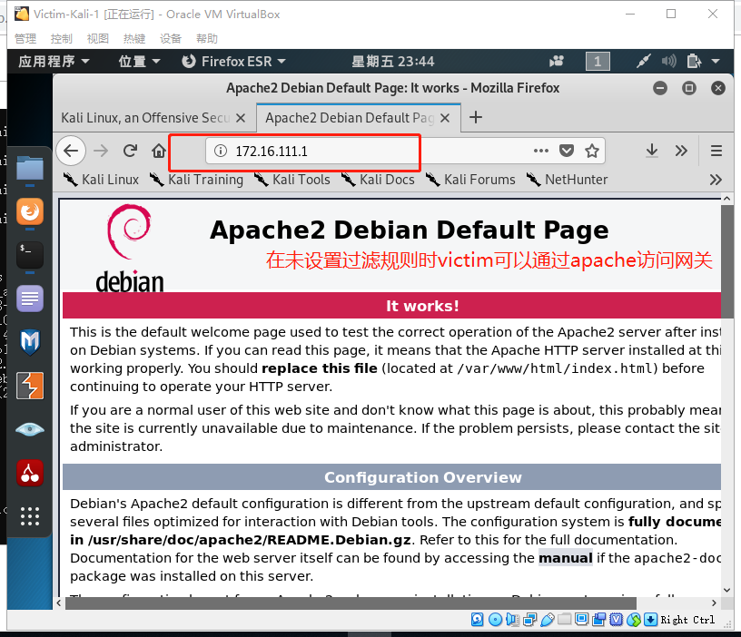

+ 对debian网关添加过滤规则，但是发现仍然可以访问，原因是我们设置的过滤规则是INPUT栈，但是apache界面是由server提供出去的

  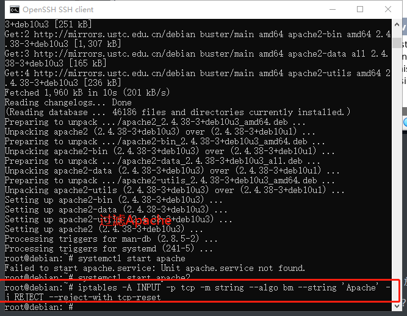

+ 但是我们可以更进一步实验，在请求参数中添加一些string请求，我们非常‘无情‘地添加了`error`，则这个参数肯定要经过INPUT链，则实验预计会成功

  ```bash
  iptables -A INPUT -p tcp -m string --algo bm --string 'error' -j REJECT --reject-with tcp-reset
  ```
  
  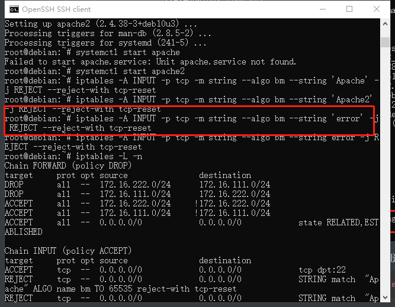
  
+ 我们查看当前iptables的规则，可以看到过滤条件

  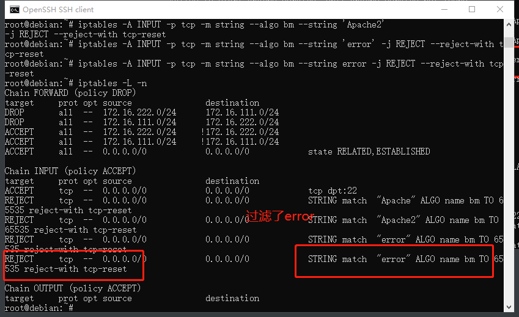

+ 接下来再对网关进行访问，预计达到效果应为返回的apache界面，发现结果也却为该界面，其实这在某种程度上实现了ip欺骗

  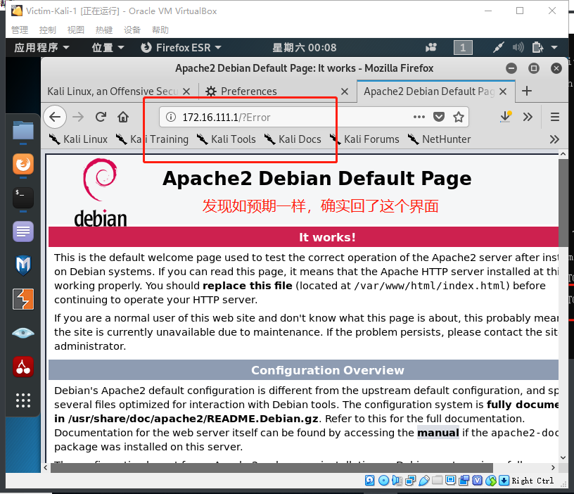

+ 我们可以通过以下指令`log`把过滤的数据包放到日志中

  ```bash
  iptables -A INPUT -p tcp -m string --algo bm --string error -LOG REJECT --reject-with tcp-reset
  ```

+ 再通过`tail -F /var/log/syslog`查看系统日志文件

  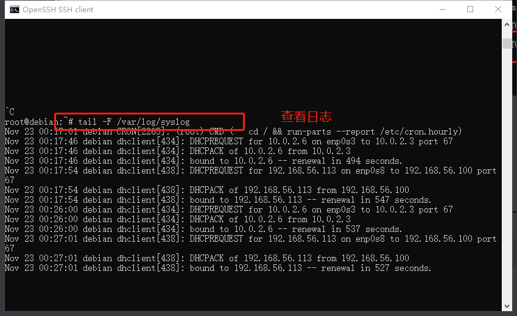


### 课外补充实验

+ 实验要求

  局域网拓扑如下：

  ```
  +----------------------+          +-------------------------+       +----------------------+     
  |     host-1           |          |   host-2                |       |     host-3           |  
  |     172.16.18.11     |          |   eth0:0 172.16.18.1    |       |     172.16.18.12     |  
  |                      |          |   eth0: 192.168.1.123   |       |                      |  
  +-------------+--------+          +----------+--------------+       +-------------+--------+  
                |                              |                                    |
                |                              |                                    |
       +--------+------------------------------+--+                                 |
       |                交换机                    |---------------------------------+
       +-----------------+------------------------+
                         |
                         |
                   +-----+-----------+
                   |   eth0          |   `
                   |   192.168.1.1   |
                +--+-----------------+---------+
                |                              |
                |        host-gw / dns-svr     |
                |                              |
                +------------------+----------++
                                   |  eth1    |
                                   +----------+
  ```

  上图的补充文字说明如下：

  - host-gw 指的是该局域网的网关，已经配置为 NAT 方式，局域网内的主机 host-2 可以正常无障碍访问互联网；
  - dns-svr 指的是该局域网中的 DNS 解析服务器，可以正常提供域名解析服务；
  - 交换机没有设置 VLAN，所有端口正常工作；
  - host-2上配置了 iptables规则；
  - host-1上配置了默认网关指向 IP 地址：172.16.18.1，域名解析服务器配置为 IP：192.168.1.1
  - host-3上配置了默认网关指向 IP 地址：172.16.18.1，域名解析服务器配置为 IP：192.168.1.1

  + host-2 上的 iptables 配置脚本如下：（带注释）

  ```bash
  #!/bin/bash
  
  IPT="/sbin/iptables"
  
  $IPT --flush
  $IPT --delete-chain# 清空 iptables中的所有链
  
  $IPT -P INPUT DROP      # drop输入
  $IPT -P FORWARD DROP    #drop转发
  $IPT -P OUTPUT ACCEPT   # 允许输出
  
  # 自定义两条链
  $IPT -N forward_demo    # 转发链
  $IPT -N icmp_demo       # icmp链
  
  $IPT -A INPUT -i lo -j ACCEPT   # 允许本地回环输入
  $IPT -A OUTPUT -o lo -j ACCEPT  # 允许本地回环输出
  
  $IPT -A INPUT -p tcp ! --syn -m state --state NEW -s 0.0.0.0/0 -j DROP# TCP 连接要求从 SYN 包开始
  $IPT -A INPUT -m state --state ESTABLISHED,RELATED -j ACCEPT# 接受连接建立后的数据包和相关的数据包
  $IPT -A INPUT -p icmp -j icmp_demo# 对 icmp 协议使用 icmp_demo 链规则
  
  $IPT -A icmp_demo -p icmp -i eth0 -j ACCEPT# 接受来自 eth0 网卡的 icmp 数据包
  $IPT -A icmp_demo -j RETURN                 # 返回 INPUT 链？
  
  $IPT -A FORWARD -j forward_demo# 对转发数据使用 forward_demo 链
  
  
  $IPT -A forward_demo -j LOG --log-prefix FORWARD_DEMO# 将防火墙过滤日志
  # 丢弃 payload 字段包含 baidu 字符串的数据包
  $IPT -A forward_demo -p tcp --dport 80 -m string --algo bm --string 'baidu' -j DROP
  
  $IPT -A forward_demo -p tcp -s 172.16.18.11 -j ACCEPT# accept源地址为 172.16.18.11 的 tcp 数据包
  $IPT -A forward_demo -p tcp -d 172.16.18.11 -j ACCEPT# accept目标地址为 172.16.18.11 的 tcp 数据包
  $IPT -A forward_demo -p udp -s 172.16.18.11 --dport 53 -j ACCEPT# 接受源地址为 172.16.18.11 或 172.16.18.1 且目标端口为 53 的 udp 数据包
  $IPT -A forward_demo -p udp -s 172.16.18.1  --dport 53 -j ACCEPT
  # 接受源地址为 192.168.56.1 且源端口为 53 的 udp 数据包
  $IPT -A forward_demo -p udp -s 192.168.56.1  --sport 53 -j ACCEPT
  # 接受源地址为 172.16.18.1 的 tcp 数据包
  $IPT -A forward_demo -p tcp -s 172.16.18.1 -j ACCEPT# 返回 FORWARD 链??
  $IPT -A forward_demo -s 172.16.18.1 -j RETURN
  
  $IPT -t nat -A POSTROUTING -s 172.16.18.1/24 -o eth0 -j MASQUERADE# 开启 NAT 转发，动态分配 IP 地址
  
  ```

+ 搭建的实验拓扑

  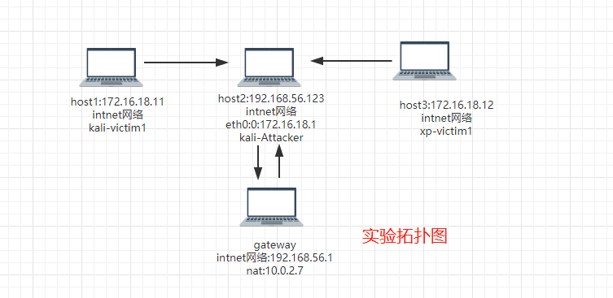
  
+ 搭建过程中注意的是：（发现做本实验最难的是配置网络拓扑情况hhh）
  
  + 由于本次实验拓扑对ip有限制要求，所以大部分都要手动配置，为了多尝试，本次实验使用了kali/debian/xp系统，均进行了手动配置尝试
  
  + xp配置ip及netmask
  
    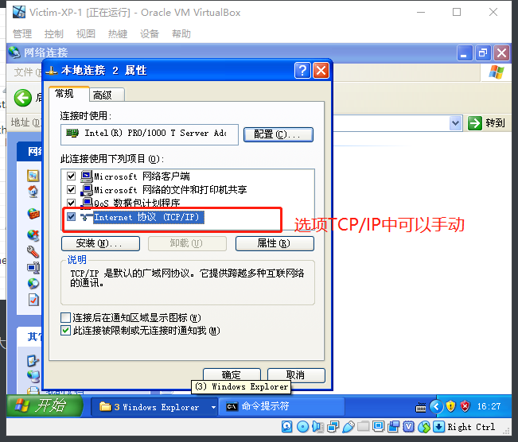
  
    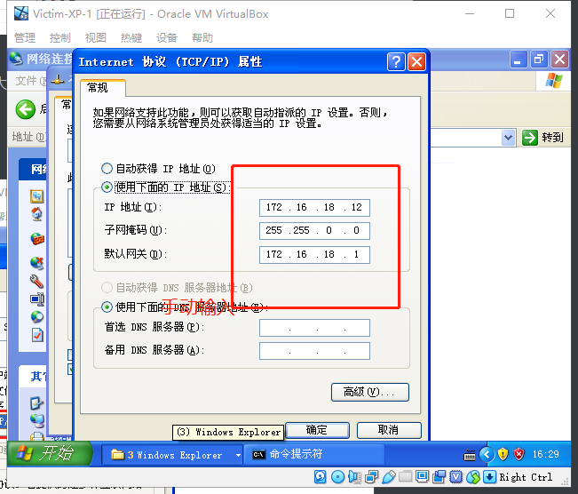
  
  + kali手动配置：只要进入`/etc/network/interfaces`编辑并保存即可
  
    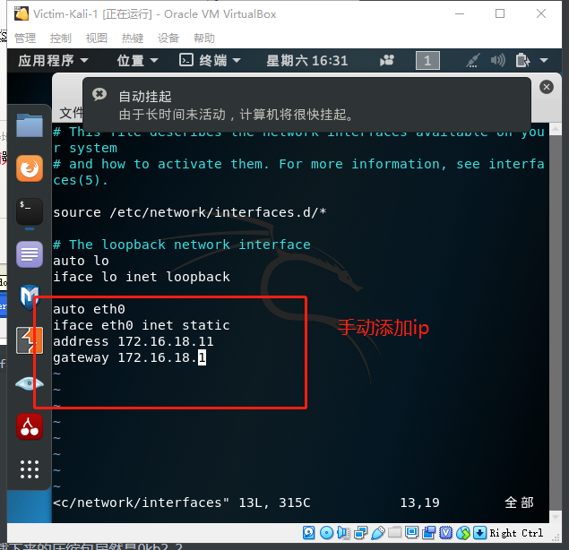
  
+ 配置好后查看各主机的ip，检查配置成功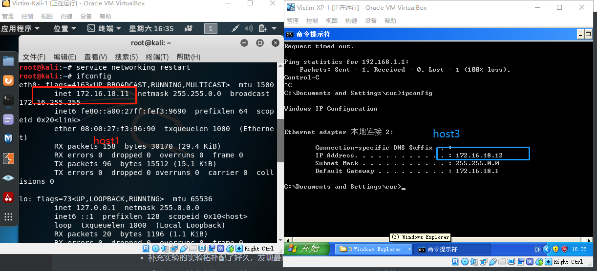
  
  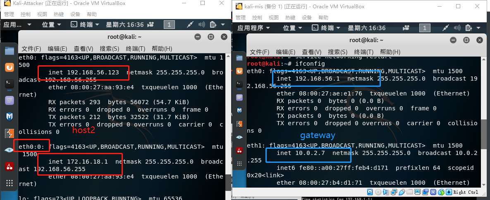
  
+ 向host2中输入要求的防火墙规则

  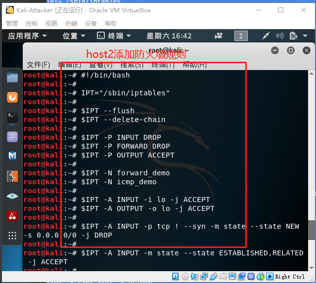

+ 配置完成以后，进行实验验证（host1和host3在验证时换了一下ip)

  - [x] host-1可以ping通ip: 172.16.18.1吗？

    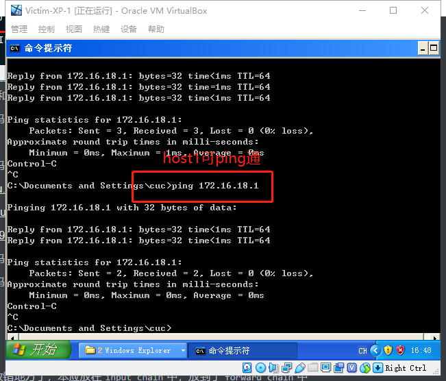

  - [ ] host-1可以ping通ip: 192.168.1.1吗？

    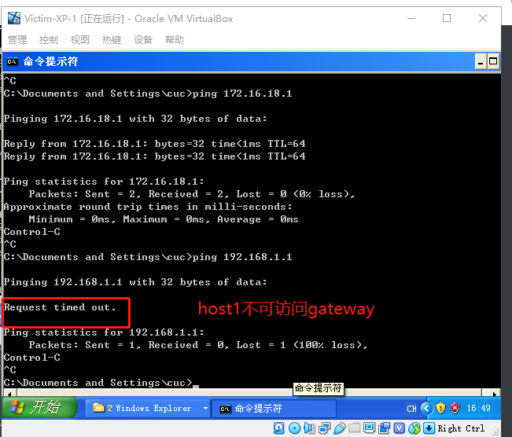

  - [ ] host-1可以ping通域名: www.baidu.com吗？

    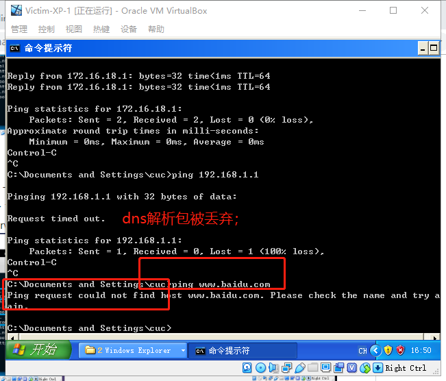

  - [ ] host-1可以访问： [http://www.baidu.com](http://www.baidu.com/) 吗？

    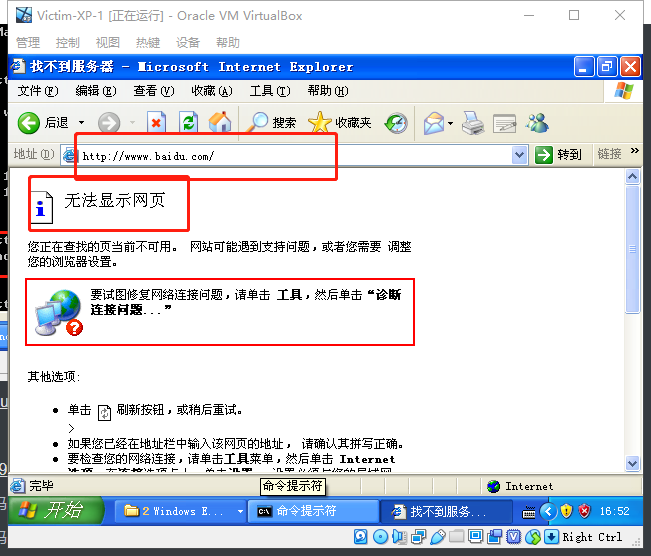

  - [x] host-1可以访问：[http://61.135.169.121](http://61.135.169.121/) 吗？

    

  - [x] host-3可以ping通ip: 172.16.18.1吗？

    

  - [ ] host-3可以ping通ip: 192.168.1.1吗？（本次实验的ip是`192.168.56.1`）

    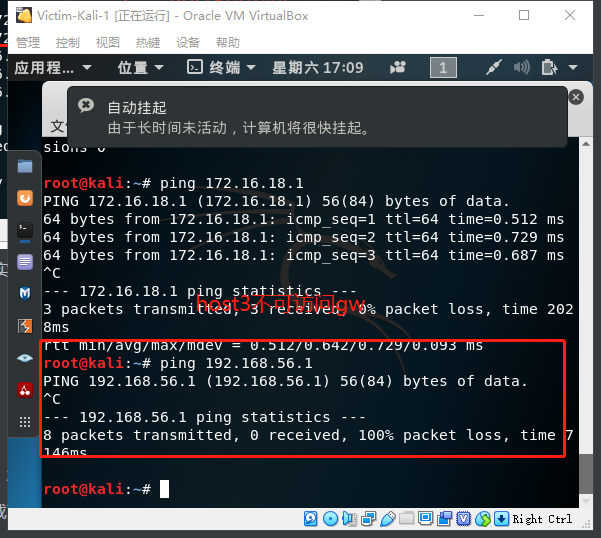

  - [ ] host-3可以访问互联网吗？

    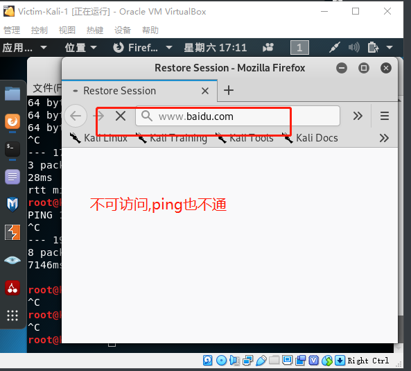

## 实验所遇问题

+ 防火墙规则添加失败，后来发现规则放错地方了，本应放在`input chain`中，放到了`forward chain`中
+ `proftpd`官方压缩包解压失败，最后发现官网下载下来的压缩包居然是0kb？？
+ 对debian网关添加过滤规则，但是发现仍然可以访问，原因是我们设置的过滤规则是INPUT，但是apache界面是由服务器提供的
+ 补充实验的实验拓扑配了好久，发现最后理解错了题意，且未分清host-only和intnet网络
+ 手动配置ip并未生效，需要输入`systemctl restart networking`重启生效
+ kali网卡手动设置非常容易自动失效，需多次重试


## 实验总结

+ 防火墙可以改变网络拓扑规则，可以实现NAT，使原本可以访问的变为无法访问，反之也可

+ 防火墙可以设置网络各层的规则，使用简单

+ 防火墙的使用其实在第五章实验的端口状态就使用过了，防火墙的作用非常强大

  

## 实验参考资料

+ [iptables-resotore](https://blog.csdn.net/leonard_up/article/details/82432984)
+ [nftables](https://wiki.nftables.org/wiki-nftables/index.php/Main_Page)
+ [ip转发](https://www.cnblogs.com/EasonJim/p/7595080.html)
+ [kali双网卡设置](https://blog.csdn.net/Blog_inG/article/details/89351758)