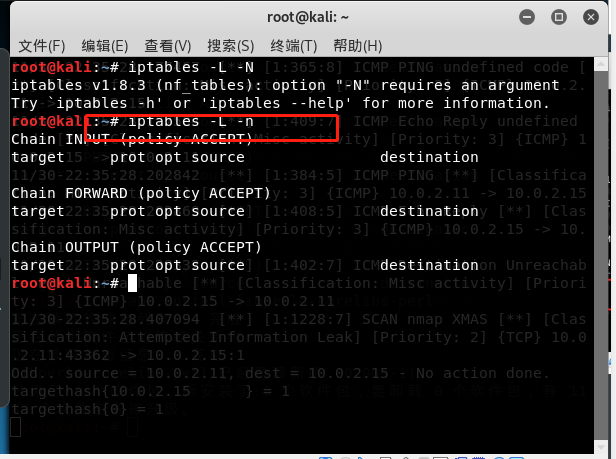

# 入侵检测

## 实验目的

+ 进行入侵检测的软件实现体验，以工具`snort`为主

## 实验要求

+ 通过配置snort不同规则来进行网络入侵检测

## 实验环境

+ 两台kali主机，可互通
+ 工具：snort

## 实验过程

### 实验一：配置snort为嗅探模式

+ 在此之前，需要安装snort

  ```bash
  # 禁止在apt安装时弹出交互式配置界面
  export DEBIAN_FRONTEND=noninteractive
  
  apt install snort
  ```

  

+ 配置snort为嗅探模式

  ```bash
  # 显示IP/TCP/UDP/ICMP头
  snort –v
  
  # 显示应用层数据
  snort -vd
  
  # 显示数据链路层报文头
  snort -vde
  
  # -b 参数表示报文存储格式为 tcpdump 格式文件
  # -q 静默操作，不显示版本欢迎信息和初始化信息
  snort -q -v -b -i eth1 "port not 22"
  
  # 使用 CTRL-C 退出嗅探模式
  # 嗅探到的数据包会保存在 /var/log/snort/snort.log.<epoch timestamp>
  # 其中<epoch timestamp>为抓包开始时间的UNIX Epoch Time格式串
  # 可以通过命令 date -d @<epoch timestamp> 转换时间为人类可读格式
  # exampel: date -d @1511870195 转换时间为人类可读格式
  # 上述命令用tshark等价实现如下：
  tshark -i eth1 -f "port not 22" -w 1_tshark.pcap
  ```

+ 进行snort的查看

  

+ 接下来使用主机进行ping百度，并查看ICMP头

  

+ 接下来显示应用层和数据链路层数据`snort -q -vd`  和`snort -q  -vde`

  

  

+ 将嗅探的数据保存下来`snort -q -v -b -i eth0 "port not 22"`

  ```bash
  # 使用 CTRL-C 退出嗅探模式
  # 嗅探到的数据包会保存在 /var/log/snort/snort.log.<epoch timestamp>
  # 其中<epoch timestamp>为抓包开始时间的UNIX Epoch Time格式串
  # 可以通过命令 date -d @<epoch timestamp> 转换时间为人类可读格式
  # exampel: date -d @1511870195 转换时间为人类可读格式
  # -b 参数表示报文存储格式为 tcpdump 格式文件
  # 上述命令用tshark等价实现如下：
  tshark -i eth1 -f "port not 22" -w 1_tshark.pcap
  ```
  
  
  
+ 获取包结果以后，可以继续对其进行分析，从而推断是否有入侵


---


### 实验二：配置并启用snort内置规则

+ 基本知识

  ```bash
  # /etc/snort/snort.conf 中的 HOME_NET 和 EXTERNAL_NET 需要正确定义
  # 例如，学习实验目的，可以将上述两个变量值均设置为 any
  snort -q -A console -b -i eth0 -c /etc/snort/snort.conf -l /var/log/snort/
  ```


+ 查看`snort.conf`配置文件中的规则

  
  
+ 将其中的`HOME_NET`和`EXTERNAL_NET`设置为`any`

  

+ 启用内置规则

  ```bash
  snort -q -A console -b -i eth0 -c /etc/snort/snort.conf -l /var/log/snort/
  ```

  


---


### 实验三：自定义snort规则

+ 新建snort规则文件

  ```bash
  # 新建自定义 snort 规则文件
  cat << EOF > /etc/snort/rules/cnss.rules
  alert tcp $EXTERNAL_NET any -> $HTTP_SERVERS 80 (msg:"Access Violation has been detected on /etc/passwd ";flags: A+; content:"/etc/passwd"; nocase;sid:1000001; rev:1;)
  alert tcp $EXTERNAL_NET any -> $HTTP_SERVERS 80 (msg:"Possible too many connections toward my http server"; threshold:type threshold, track by_src, count 100, seconds 2; classtype:attempted-dos; sid:1000002; rev:1;)
  EOF
  ```

+ 添加新的配置到原始配置文件

  ```bash
  # 添加配置代码到 /etc/snort/snort.conf
  include $RULE_PATH/cnss.rules
  ```

+ 启用新的配置

  ```bash
  snort -q -A fast -b -i eth1 -c /etc/snort/snort.conf -l /var/log/snort/
  ```

+ 在attacker主机上进行snort规则的配置，使其对一定数量的http请求发出警报，victim使用[ab](https://man.linuxde.net/ab)指令对端口80进行访问

  

  

+ 发现确实靶机发出了警报，可见我们的配置生效了

  


---


### 实验四：和防火墙联动

+ 下载并压缩  [Guardian-1.7.tar.gz](https://c4pr1c3.github.io/cuc-ns/chap0x09/attach/guardian.tar.gz)  

  ```bash
  # 解压缩 Guardian-1.7.tar.gz
  tar zxf guardian.tar.gz
  
  # 安装 Guardian 的依赖 lib
  apt install libperl4-corelibs-perl
  ```

  
  
+ 在靶机上先后开启 `snort` 和 `guardian.pl` 

  ```bash
  # 开启 snort
  snort -q -A fast -b -i eth1 -c /etc/snort/snort.conf -l /var/log/snort/
  ```

+  编辑 guardian.conf 并保存，确认以下2个参数的配置符合主机的实际环境参数。 并启动

  ```bash
  HostIpAddr      192.168.56.102
  Interface       eth1
  # 启动 guardian.pl
  perl guardian.pl -c guardian.conf
  ```

  

+ 开启guardian.pl

  ```bash
  # 启动 guardian.pl
  perl guardian.pl -c guardian.conf
  ```

  

+ 在攻击者上对靶机进行nmap暴力扫描

  ```bash
  nmap 10.0.2.15 -A -T4 -n -vv
  ```

  

+ 查看此时guardian的状态

  

+ 查看此时防火墙的链，guardian.conf 中默认的来源IP被屏蔽时间是 60 秒，在一分钟之后会更新iptable的规则会被删除

  ```bash
  root@KaliRolling:~/guardian# iptables -L -n
  Chain INPUT (policy ACCEPT)
  target     prot opt source               destination
  REJECT     tcp  --  192.168.56.101       0.0.0.0/0            reject-with tcp-reset
  DROP       all  --  192.168.56.101       0.0.0.0/0
  
  Chain FORWARD (policy ACCEPT)
  target     prot opt source               destination
  
  Chain OUTPUT (policy ACCEPT)
  target     prot opt source               destination
  # 1分钟后，guardian.pl 会删除刚才添加的2条 iptables 规则
  root@KaliRolling:~/guardian# iptables -L -n
  Chain INPUT (policy ACCEPT)
  target     prot opt source               destination
  
  Chain FORWARD (policy ACCEPT)
  target     prot opt source               destination
  
  Chain OUTPUT (policy ACCEPT)
  target     prot opt source               destination
  ```

  

  

+ 由上可知，在 攻击者暴力扫描过程中，靶机上的 iptables 添加了拒绝和丢弃的规则；过一段时间后，拒绝和丢弃的规则被删除 


---


### 课后思考题

+  IDS与防火墙的联动防御方式相比IPS方式防御存在哪些缺陷？是否存在相比较而言的优势？ 
  + 入侵检测系统（IDS）和入侵防御系统（IPS）都是网络基础架构的一部分。IDS / IPS将网络数据包与包含已知网络攻击签名的网络威胁数据库进行比较-并标记任何匹配的数据包。
  + 我认为，它们之间的主要区别是IDS是监视系统，而IPS是控制系统。IDS是进行主动防御，而IPS是进行被动防御。
  + IDS不会以任何方式更改网络数据包，而IPS会根据数据包的内容阻止数据包的传递，就像防火墙如何阻止IP地址进行通信一样。
    - **入侵检测系统（IDS）**：分析和监视网络流量以寻找迹象，表明攻击者正在使用已知的网络威胁来渗透或窃取网络中的数据。IDS系统将当前网络活动与已知威胁数据库进行比较，以检测多种行为，例如违反安全策略，恶意软件和端口扫描程序。
    - **入侵防御系统（IPS）**：位于外部世界和内部网络之间，与防火墙位于网络的同一区域。如果该数据包表示已知的安全威胁，则IPS会根据安全配置文件主动*拒绝*网络流量。


## 实验所遇问题

+ 虚拟机一直连不上网，结果发现是上次的防火墙实验手动设置了ip，说明以后每次实验都最好恢复环境的纯净性，否则将影响实验结果


## 实验总结

+  入侵检测可以识别入侵者，识别入侵行为，监视和检测已成功的安全突破，为对抗入侵及时提供重要信息 
+  Snort 的设计遵守轻量级的网络入侵检测系统，基于 Libpcap 的报文嗅探接口，基于规则的检测引擎和支持无限扩展的插件系统。 


## 实验参考资料

+ [snort mannual](http://manual-snort-org.s3-website-us-east-1.amazonaws.com/)
+ [ab指令](https://man.linuxde.net/ab)
+ [Suricata](https://suricata.readthedocs.io/en/latest/rules/intro.html)
+ [课本第九章](https://c4pr1c3.github.io/cuc-ns/chap0x09/main.html)
+ [suricata手册](https://suricata.readthedocs.io/en/latest/)
+ [IDS/IPS](https://www.varonis.com/blog/ids-vs-ips/)